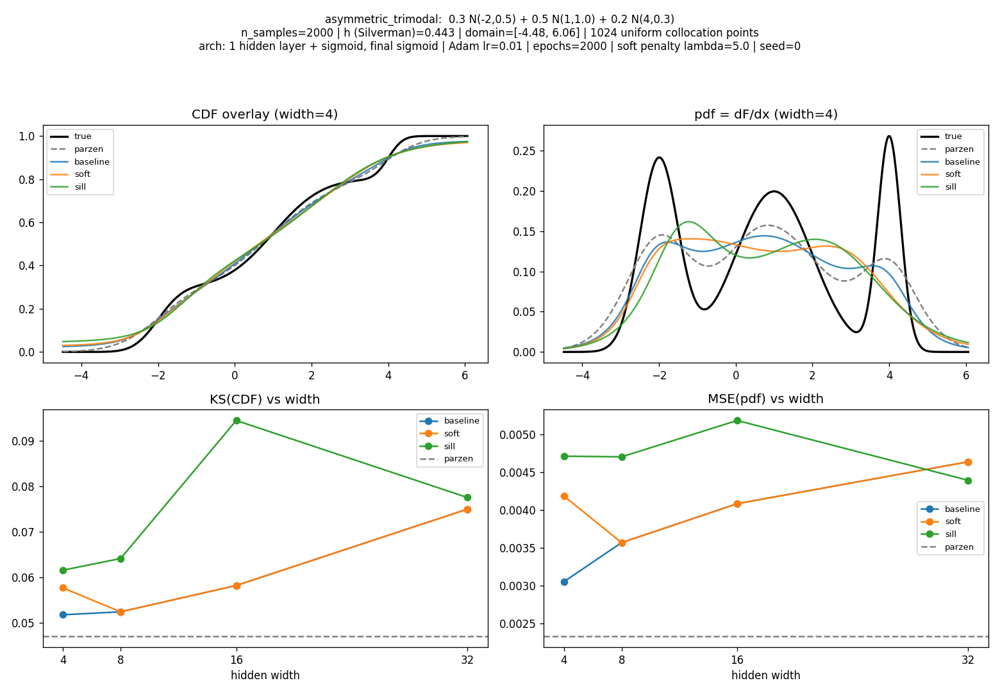
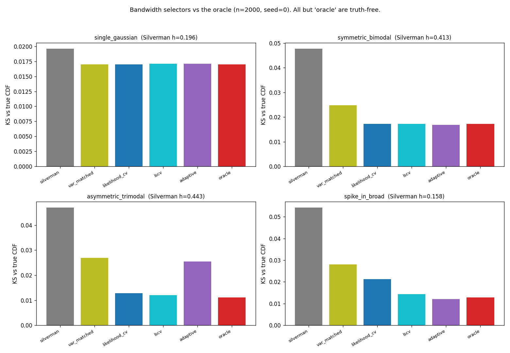

# Parzen CDF

Neural estimation of a cumulative distribution function (CDF) and its density (pdf), using
Parzen-window estimates as training targets.

Master's project. The core idea: a Parzen-window estimator gives a smooth, closed-form CDF
estimate; we train an MLP to regress that CDF under a monotonicity constraint, then obtain the
pdf as the derivative of the trained network. We work first in one dimension, then extend to N.

## Roadmap

**Step 1 — Univariate.**
1. Sample synthetic data from a *known* pdf (a non-trivial mixture of Gaussians).
2. Estimate the CDF with **Parzen windows using logistic kernels**, whose integral is the
   logistic sigmoid — giving a closed-form CDF estimate `F̂(x) = (1/n) Σ σ((x − xᵢ)/h)`.
3. Build a training set of `(x, F̂(x))` pairs.
4. Train an MLP to regress the CDF, with a **monotonicity constraint in the loss**.
5. Recover the pdf as the derivative of the network output (clamping negatives to zero if needed).

**Step 2 — Multivariate.**
1. Synthetic data on an N-dimensional domain (N grows as experiments succeed).
2. N-D (product) logistic Parzen windows for the joint CDF.
3. Training set and MLP as before, re-imposing monotonicity.
4. Recover the joint pdf via mixed partial derivatives, or the **copula** (Sklar's theorem).

See [docs/references.md](docs/references.md) for the bibliography.

## Results so far (Step 1)

A working univariate pipeline, evaluated against the *known* truth on a ladder of Gaussian
mixtures:

- **Logistic Parzen CDF/pdf estimator** with a closed-form CDF and a Silverman-rule bandwidth.
- **Neural CDF regressor** trained on uniform collocation targets, comparing three monotonicity
  strategies — unconstrained baseline, a soft derivative penalty, and a monotone-by-construction
  (Sill 1998) network — with the pdf recovered by differentiating the learned CDF.
- **Bandwidth study**: Silverman over-smooths multimodal densities; data-driven cross-validation
  selectors recover most of the gap to an oracle bandwidth, and an adaptive (Abramson) bandwidth
  wins on disparate-scale densities.

The neural CDF/pdf fit on the asymmetric trimodal mixture, and the bandwidth-selector comparison:




All figures are reproducible via the scripts in [`scripts/`](scripts/) (e.g.
`python scripts/generate_results.py`).

## Setup

```bash
python -m venv .venv
source .venv/bin/activate
pip install -r requirements.txt
pip install -e .
pytest          # sanity checks
```

## Layout

```
src/parzen_cdf/   library code (data, parzen, models, training, metrics)
notebooks/        exploratory experiments
scripts/          reproducible runs
tests/            sanity checks
docs/             references and notes
```
