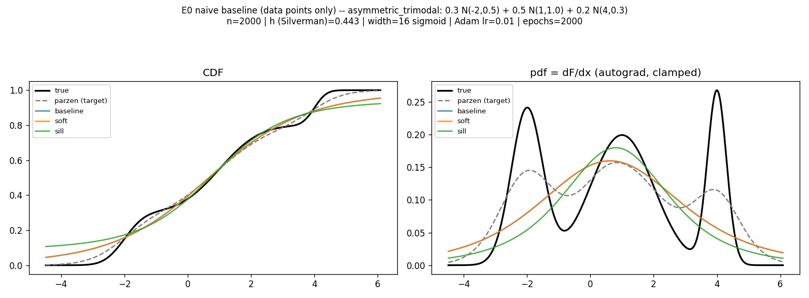

# Experiments — neural CDF/pdf from Parzen targets

Track record for the `experiments/cdf-extension` branch. Every idea is logged here, including the
ones that don't pan out. A progressive LaTeX write-up of the same material lives in
[`../report/report.tex`](../report/report.tex).

## The pipeline (constraint-correct)

1. Pick a known CDF/pdf — a 1-D Gaussian mixture (closed-form truth).
2. Draw a fixed number of samples `X = {x₁..xₙ}` from it.
3. Fit a logistic-window Parzen estimator on the samples (unsupervised; window initially fixed
   size, Silverman): `F̂(x) = (1/n) Σ σ((x − xᵢ)/h)`.
4. Train a sigmoidal MLP to estimate the **true** CDF, using **label `F̂(xᵢ)` at each sample point
   `xᵢ` only**.
5. Recover the pdf from the learned CDF, via 5.1) the autograd/empirical derivative `dF/dx`, or
   5.2) the copula (Sklar; multivariate / later).

### Hard constraints (inviolable)

- **Train on the data points only.** Inputs are exactly the `n` drawn samples `xᵢ`; labels are
  `F̂(xᵢ)`. We do **not** sample the Parzen CDF at synthetic `x`, build collocation grids, produce
  extra representations, or augment the data.
- **Monotone non-decreasing CDF**, enforced by a loss penalty, a downstream rectification, or a
  monotone-by-construction architecture.
- **Sigmoidal network**; **Gaussian-mixture** targets (the four ladder distributions in
  `parzen_cdf.data`).

### Rectification of the inherited code

`training.make_training_set` trains on ~1024 **uniform collocation** points labelled with `F̂` — it
samples the Parzen CDF at synthetic `x`, violating constraint 1. It is kept as an *out-of-constraint
reference* only. The constraint-correct builder is `training.make_sample_training_set(samples, h)`,
which returns `(xᵢ, F̂(xᵢ))` for the `n` samples. All experiments here use the latter.

## Conventions

- **Referee:** every estimate is scored against the *known* analytic truth on a dense evaluation
  grid (the grid and truth are evaluation only — never training data).
- **Metrics:** `KS(CDF) = max|F_true − F̂|`; `MSE(pdf)`; monotonicity violation fraction (share of
  decreasing CDF steps on the grid); recovered pdf mass `∫ f̂ dx` (should be ≈ 1).
- **Parzen row:** the Parzen estimate is the target the MLP fits — it is the *ceiling* for a given
  `h`. The MLP cannot beat it on the CDF unless it incidentally undoes the bandwidth's over-smoothing.
- **Reproducibility:** `seed=0`; seed set before model construction and inside `train_cdf`.

## Roadmap

Start naive, change one knob at a time, keep the truth as referee, and accumulate an ablation
table. Progression is gated — we only move to a later phase when the current one is understood.

| Phase | Experiment | Axis | Status |
|---|---|---|---|
| 0 | **E0** Naive baseline + monotonicity-strategy anchor | regime + monotonicity | ✅ done |
| 1 | E1 Capacity | hidden width, depth | ⬜ planned |
| 1 | E2 Optimization | learning rate, epochs | ⬜ planned |
| 1 | E3 Bandwidth / target quality | Silverman → var-matched → CV → adaptive (variable window) | ⬜ planned |
| 1 | E4 Sample count | n | ⬜ planned |
| 1 | E5 Monotonicity strategy | soft-λ vs Sill vs downstream rectification; pdf-mass renormalisation | ⬜ planned |
| 2 | E6 Interactions & best-of | combine per-axis winners, isolate best pipeline | ⬜ planned |
| 3 | E7 pdf recovery | derivative quality, mass loss, boundary handling | ⬜ planned |
| 4 | — Harder approaches (gated) | multivariate, copula (Sklar), adaptive architectures | ⬜ later |

### Hypothesis ledger

- **H1 (capacity):** width-16 under-fits the multimodal CDF; more width/depth closes the gap to the
  Parzen target — until it starts over-fitting the (smoothed, finite-sample) target and
  re-introduces monotonicity violations. *(open — motivated by E0)*
- **H2 (optimization):** 2000 epochs at lr 1e-2 leaves the small net under-trained; more
  epochs / tuned lr improves the fit. Interacts with H1. *(open)*
- **H3 (target quality):** Silverman over-smooths multimodal densities, so the *target itself*
  caps accuracy; a finer / variable (adaptive) bandwidth raises the ceiling but adds target noise.
  *(open — visible in E0: even a perfect fit to the gray Parzen curve misses the true modes)*
- **H4 (samples):** more samples densify supervision and sharpen `F̂`; diminishing returns since
  Silverman `h ∝ n^(−1/5)`. *(open)*
- **H5 (monotonicity):** unconstrained nets are already monotone at small scale (so the soft
  penalty is inactive); the constraint only bites at higher capacity / finer `h`. Sill guarantees
  monotonicity but loses accuracy and mass. Downstream rectification (cumulative max + renormalise)
  may be the cheapest guarantee. *(partly answered by E0; revisit under H1/H3)*
- **H6 (pdf mass):** the learned CDF does not fully span 0→1 over the grid, so the recovered pdf
  under-integrates (~0.82–0.96 in E0); a normalisation or boundary treatment recovers the mass.
  *(open)*

---

## E0 — Naive baseline (data points only)

**Hypothesis.** A small sigmoidal MLP trained on `(xᵢ, F̂(xᵢ))` recovers the Parzen target
reasonably; monotonicity may not yet be binding; by-construction monotonicity (Sill) costs accuracy.

**Setup.** All four mixtures. `n = 2000`; fixed **Silverman** bandwidth; one hidden layer of
**width 16**, sigmoid activation + final sigmoid; **Adam lr 1e-2**, **2000 epochs**; `seed=0`.
Training set = data points only. Three monotonicity arms (Edo's variants, reused):
`baseline` (unconstrained), `soft` (penalty λ=5 on a uniform grid over the observed data range),
`sill` (monotone by construction). pdf = autograd `dF/dx`, negatives clamped.

**Results** (`parzen` row = the target / ceiling; lower KS & MSE better; mass → 1 ideal):

| dist | variant | KS(CDF) | MSE(pdf) | viol% | pdf mass |
|---|---|---|---|---|---|
| single_gaussian (h=0.196) | parzen | 0.0196 | 0.00019 | 0.00% | 0.9999 |
| | baseline | 0.0319 | 0.00024 | 0.00% | 0.9793 |
| | soft | 0.0319 | 0.00024 | 0.00% | 0.9793 |
| | sill | 0.0774 | 0.00094 | 0.00% | 0.8786 |
| symmetric_bimodal (h=0.413) | parzen | 0.0477 | 0.00154 | 0.00% | 0.9991 |
| | baseline | 0.1144 | 0.00828 | 0.00% | 0.9092 |
| | soft | 0.1144 | 0.00828 | 0.00% | 0.9092 |
| | sill | 0.1599 | 0.00916 | 0.00% | 0.8266 |
| asymmetric_trimodal (h=0.443) | parzen | 0.0470 | 0.00232 | 0.00% | 0.9957 |
| | baseline | 0.0883 | 0.00474 | 0.00% | 0.9096 |
| | soft | 0.0883 | 0.00474 | 0.00% | 0.9096 |
| | sill | 0.1268 | 0.00545 | 0.00% | 0.8164 |
| spike_in_broad (h=0.158) | parzen | 0.0542 | 0.00336 | 0.00% | 0.9999 |
| | baseline | 0.0590 | 0.00361 | 0.00% | 0.9729 |
| | soft | 0.0590 | 0.00361 | 0.00% | 0.9729 |
| | sill | 0.0934 | 0.00717 | 0.00% | 0.8783 |

**Observations.**

1. **`baseline ≡ soft` exactly.** The unconstrained net already has 0% monotonicity violations, so
   `mean(relu(−dF/dx)) = 0` and the penalty contributes no gradient. Monotonicity is **not binding**
   at this scale → motivates H5 (revisit at higher capacity / finer `h`).
2. **Under-fitting dominates.** The recovered pdf (figure) is a single smooth bump that misses the
   trimodal structure — even though the net cleanly fits its training labels (`train_MSE ~3e-4`).
   The width-16 net has too little capacity / training to express the shape → H1, H2.
3. **Two stacked headrooms.** The Parzen target itself (gray) is over-smoothed by Silverman and
   already misses the true modes; so improving the neural fit alone cannot reach the truth — the
   bandwidth/target must improve too → H3.
4. **Sill underperforms** on every distribution (higher KS/MSE) and loses the most mass
   (0.82–0.88): non-negative weights cost expressiveness at width 16.
5. **pdf mass < 1 for all neural arms** (0.82–0.98) vs Parzen ≈ 1.0 → H6.

**Verdict.** Baseline established. The naive net is in a clear under-fitting regime with an
over-smoothed target — exactly the headroom Phase 1 (capacity, training, bandwidth) will probe.
Reproduce with `python scripts/experiments/e0_naive_baseline.py` (writes `results/e0_naive_*.png`,
`results/e0_naive_baseline.json`).
