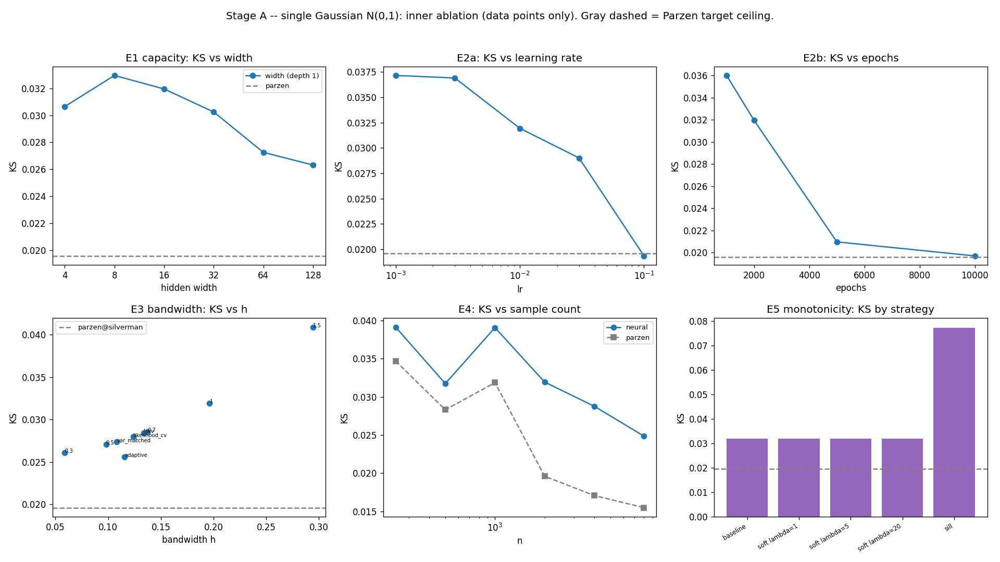
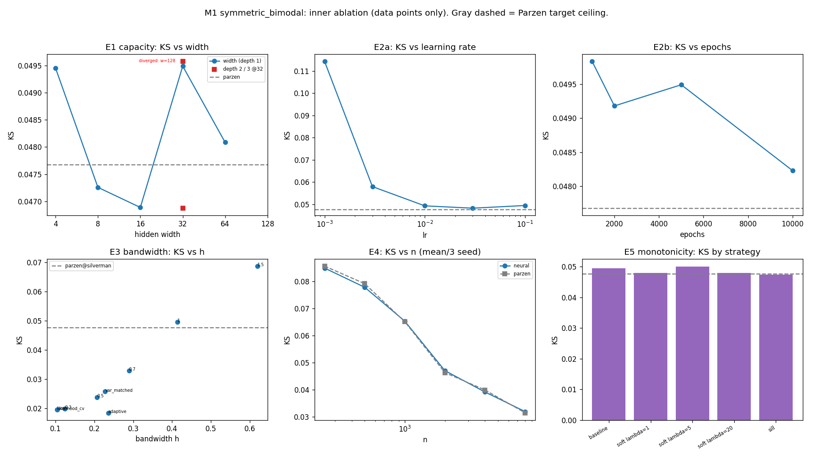
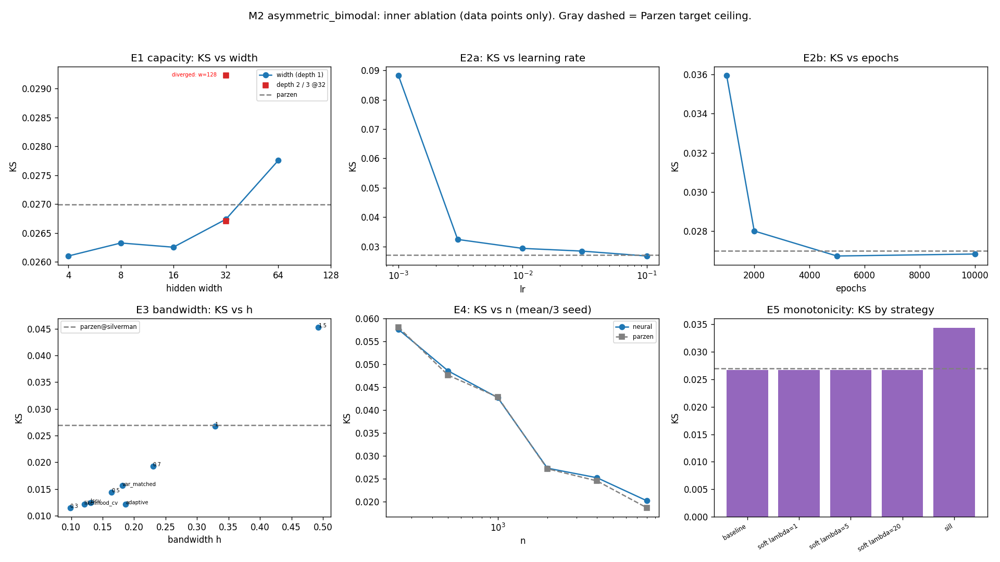
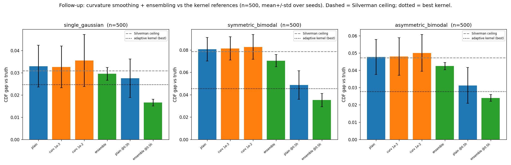

# Experiments — neural CDF/pdf from Parzen targets

Track record for the `experiments/cdf-extension` branch. Every idea is logged here, including the
ones that don't pan out. A progressive LaTeX write-up of the same material lives in
[`../report/report.tex`](../report/report.tex).

## The pipeline (constraint-correct)

1. Pick a known CDF/pdf — a 1-D Gaussian mixture (closed-form truth).
2. Draw a fixed number of samples `X = {x₁..xₙ}` from it.
3. Fit a logistic-window Parzen estimator on the samples (unsupervised; window initially fixed
   size, Silverman): `F̂(x) = (1/n) Σ σ((x − xᵢ)/h)`.
4. Train a sigmoidal MLP to estimate the **true** CDF, using **label `F̂(xᵢ)` at each sample point
   `xᵢ` only**.
5. Recover the pdf from the learned CDF, via 5.1) the autograd/empirical derivative `dF/dx`, or
   5.2) the copula (Sklar; multivariate / later).

### Hard constraints (inviolable)

- **Train on the data points only.** Inputs are exactly the `n` drawn samples `xᵢ`; labels are
  `F̂(xᵢ)`. We do **not** sample the Parzen CDF at synthetic `x`, build collocation grids, produce
  extra representations, or augment the data.
- **Monotone non-decreasing CDF**, enforced by a loss penalty, a downstream rectification, or a
  monotone-by-construction architecture.
- **Sigmoidal network**; **Gaussian-mixture** targets (the four ladder distributions in
  `parzen_cdf.data`).

### Rectification of the inherited code

`training.make_training_set` trains on ~1024 **uniform collocation** points labelled with `F̂` — it
samples the Parzen CDF at synthetic `x`, violating constraint 1. It is kept as an *out-of-constraint
reference* only. The constraint-correct builder is `training.make_sample_training_set(samples, h)`,
which returns `(xᵢ, F̂(xᵢ))` for the `n` samples. All experiments here use the latter.

## Conventions

- **Referee:** every estimate is scored against the *known* analytic truth on a dense evaluation
  grid (the grid and truth are evaluation only — never training data).
- **Metrics:** `KS(CDF) = max|F_true − F̂|`; `MSE(pdf)`; monotonicity violation fraction (share of
  decreasing CDF steps on the grid); recovered pdf mass `∫ f̂ dx` (should be ≈ 1).
- **Parzen row:** the Parzen estimate is the target the MLP fits — it is the *ceiling* for a given
  `h`. The MLP cannot beat it on the CDF unless it incidentally undoes the bandwidth's over-smoothing.
- **Reproducibility:** `seed=0`; seed set before model construction and inside `train_cdf`.

## Roadmap — distribution ladder (outer) × ablation axes (inner)

We explore step 1 **deeply**: distribution complexity is the *outer* progression, the ablation axes
are the *inner* deep-dive. We exhaust the inner axes on a simple distribution before adding
complexity. Univariate only — the multivariate case is parked until step 1 is understood. Progression
is gated.

**Outer ladder (distributions):**

| Stage | id | pdf | status |
|---|---|---|---|
| A | `G1` | `N(0,1)` | ✅ deep dive done |
| B | `M1` | `0.5·N(−2,0.7) + 0.5·N(2,0.7)` — symmetric bimodal | ✅ deep dive done |
| B | `M2` | `0.65·N(0,1) + 0.35·N(3,0.6)` — asymmetric bimodal | ✅ deep dive done |
| C | `T1` | `0.3·N(−2,0.5) + 0.5·N(1,1) + 0.2·N(4,0.3)` — trimodal | ⬜ next |
| C | `S1` | `0.6·N(0,1.5) + 0.4·N(0.5,0.2)` — spike-in-broad | ⬜ later |
| C | `R*` | random k-mode mixtures — arbitrary complex 1D | ⬜ later |

**Inner axes (run per stage):** E1 capacity (width, depth) · E2 optimization (lr, epochs) · E3
bandwidth / target quality (Silverman → var-matched → CV → adaptive) · E4 sample count · E5
monotonicity strategy (soft-λ vs Sill vs downstream rectification; pdf-mass renormalisation). Then
E6 (combine per-axis winners) and E7 (pdf recovery: mass loss, boundary handling).

*Note on E0:* the first naive baseline (below) ran all four of Edo's distributions at a single
config — a premature cross-distribution snapshot. It is superseded by the staged dives but kept for
the multimodal preview it gave.

### Hypothesis ledger

- **H1 (capacity):** *G1:* width helps with diminishing returns; depth-2 best, depth-3 harder.
  *M1/M2:* capacity **plateaus early** — widths 4–64 sit at the Parzen ceiling (the smooth bimodal
  target needs little capacity once lr is adequate). Under-fitting was an *optimisation*, not a
  capacity, problem. Re-test on the sharp multimodal cases (Stage C).
- **H2 (optimization):** *Confirmed.* lr 1e-3 under-trains badly (M1 0.114, M2 0.088); lr ≥ 1e-2 and
  epochs ≥ 2000 reach the Parzen ceiling. **But lr 0.1 + width 128 diverged** (KS 1.0, mass 0) on
  both bimodals → high lr is unstable at large width. Safe sweet spot: **lr ≈ 0.03**, not 0.1.
- **H3 (target quality):** *Confirmed — the dominant lever on mixtures.* Finer `h` / CV / adaptive
  selectors roughly **halve** KS vs Silverman (M1 0.048→0.019, M2 0.027→0.012); over-smoothing
  (1.5×) is worst. (Minor on the unimodal G1, as expected.)
- **H4 (samples):** *Confirmed* (now 3-seed averaged on M1/M2): clean monotone improvement with `n`,
  and the neural KS tracks the Parzen KS at every `n`.
- **H5 (monotonicity):** *Confirmed not binding through Stage B.* 0 violations everywhere → soft
  penalty inactive (`baseline ≡ soft`). Sill was a large cost on G1 (small net) but is ~competitive
  on M1/M2 at width 32 / lr 0.1. Downstream rectification stays deferred until violations appear
  (expected on sharp/overlapping modes — Stage C).
- **H6 (pdf mass):** mass ≈ 0.99 once trained on G1/M1/M2; post-hoc normalisation barely helps.
  Larger effect only where mass loss is larger (the E0 multimodal preview showed 0.82–0.91).
- **H7 (faithful regressor) — *key finding*:** the neural KS ≈ the Parzen KS across both `h`
  (E3) and `n` (E4). The MLP is a *faithful* CDF regressor; given adequate (not over-aggressive)
  optimisation, the accuracy-vs-truth bottleneck is the **Parzen target**, not the network. So the
  highest-leverage move within the constraints is better *truth-free bandwidth selection*.
- **H8 (explicit smoothing fails) — *follow-up*:** regularising the net toward smoothness does **not**
  denoise. Weight decay is actively harmful (it pulls the output toward a flat `σ(0)=0.5`); a
  CDF-appropriate curvature penalty on `d²F/dx²` is neutral-to-mildly-harmful. The width-32 net is
  already implicitly smooth enough — extra smoothing only adds bias.
- **H9 (the net *can* beat the kernel) — *follow-up, the payoff*:** ensembling robustly beats the
  Silverman ceiling (variance reduction, larger at small `n`); and an **ensemble on a sharper
  (0.5×) bandwidth beats even the best truth-free kernel (adaptive)** at small `n` (n=500, all three
  distributions). The sharper bandwidth lowers bias; the ensemble cleans the resulting variance. The
  effect is a small-sample phenomenon — at `n=2000` the net beats only the default, not the best,
  kernel.

---

## E0 — Early cross-distribution naive snapshot (superseded by Stage A)

**Hypothesis.** A small sigmoidal MLP trained on `(xᵢ, F̂(xᵢ))` recovers the Parzen target
reasonably; monotonicity may not yet be binding; by-construction monotonicity (Sill) costs accuracy.

**Setup.** All four mixtures. `n = 2000`; fixed **Silverman** bandwidth; one hidden layer of
**width 16**, sigmoid activation + final sigmoid; **Adam lr 1e-2**, **2000 epochs**; `seed=0`.
Training set = data points only. Three monotonicity arms (Edo's variants, reused):
`baseline` (unconstrained), `soft` (penalty λ=5 on a uniform grid over the observed data range),
`sill` (monotone by construction). pdf = autograd `dF/dx`, negatives clamped.

**Results** (`parzen` row = the target / ceiling; lower KS & MSE better; mass → 1 ideal):

| dist | variant | KS(CDF) | MSE(pdf) | viol% | pdf mass |
|---|---|---|---|---|---|
| single_gaussian (h=0.196) | parzen | 0.0196 | 0.00019 | 0.00% | 0.9999 |
| | baseline | 0.0319 | 0.00024 | 0.00% | 0.9793 |
| | soft | 0.0319 | 0.00024 | 0.00% | 0.9793 |
| | sill | 0.0774 | 0.00094 | 0.00% | 0.8786 |
| symmetric_bimodal (h=0.413) | parzen | 0.0477 | 0.00154 | 0.00% | 0.9991 |
| | baseline | 0.1144 | 0.00828 | 0.00% | 0.9092 |
| | soft | 0.1144 | 0.00828 | 0.00% | 0.9092 |
| | sill | 0.1599 | 0.00916 | 0.00% | 0.8266 |
| asymmetric_trimodal (h=0.443) | parzen | 0.0470 | 0.00232 | 0.00% | 0.9957 |
| | baseline | 0.0883 | 0.00474 | 0.00% | 0.9096 |
| | soft | 0.0883 | 0.00474 | 0.00% | 0.9096 |
| | sill | 0.1268 | 0.00545 | 0.00% | 0.8164 |
| spike_in_broad (h=0.158) | parzen | 0.0542 | 0.00336 | 0.00% | 0.9999 |
| | baseline | 0.0590 | 0.00361 | 0.00% | 0.9729 |
| | soft | 0.0590 | 0.00361 | 0.00% | 0.9729 |
| | sill | 0.0934 | 0.00717 | 0.00% | 0.8783 |

**Observations.**

1. **`baseline ≡ soft` exactly.** The unconstrained net already has 0% monotonicity violations, so
   `mean(relu(−dF/dx)) = 0` and the penalty contributes no gradient. Monotonicity is **not binding**
   at this scale → motivates H5 (revisit at higher capacity / finer `h`).
2. **Under-fitting dominates.** The recovered pdf (figure) is a single smooth bump that misses the
   trimodal structure — even though the net cleanly fits its training labels (`train_MSE ~3e-4`).
   The width-16 net has too little capacity / training to express the shape → H1, H2.
3. **Two stacked headrooms.** The Parzen target itself (gray) is over-smoothed by Silverman and
   already misses the true modes; so improving the neural fit alone cannot reach the truth — the
   bandwidth/target must improve too → H3.
4. **Sill underperforms** on every distribution (higher KS/MSE) and loses the most mass
   (0.82–0.88): non-negative weights cost expressiveness at width 16.
5. **pdf mass < 1 for all neural arms** (0.82–0.98) vs Parzen ≈ 1.0 → H6.

**Verdict.** Baseline established. The naive net is in a clear under-fitting regime with an
over-smoothed target — exactly the headroom Phase 1 (capacity, training, bandwidth) will probe.
Reproduce with `python scripts/experiments/e0_naive_baseline.py` (writes `results/e0_naive_*.png`,
`results/e0_naive_baseline.json`).

---

## Stage A — single Gaussian `N(0,1)`: inner ablation (deep dive)

**Hypothesis.** On the simplest target — one mode, no mixture — isolate how each knob moves the
neural CDF fit, with no multimodality confound, and learn which axes matter before adding mixtures.

**Setup.** `N(0,1)`; referee grid `[−6, 6]`; one knob varied off the naive baseline (width 16,
lr 1e-2, 2000 epochs, Silverman `h`, `n=2000`, unconstrained); data points only; `seed=0`. **Parzen
ceiling: KS = 0.0196, MSE(pdf) = 0.00012.** `MSEn` below = pdf MSE after mass-normalisation
(dividing the recovered pdf by its integral).

**E1 — capacity** (width at depth 1; then depth at width 32)

| config | KS | MSE(pdf) | MSEn | mass |
|---|---|---|---|---|
| width=4 | 0.0306 | 0.00012 | 0.00008 | 0.955 |
| width=8 | 0.0329 | 0.00012 | 0.00007 | 0.971 |
| width=16 | 0.0319 | 0.00016 | 0.00014 | 0.993 |
| width=32 | 0.0302 | 0.00014 | 0.00013 | 0.995 |
| width=64 | 0.0273 | 0.00014 | 0.00014 | 0.998 |
| width=128 | 0.0263 | 0.00012 | 0.00012 | 0.998 |
| **depth=2 (32,32)** | **0.0208** | 0.00010 | 0.00010 | 0.995 |
| depth=3 (32,32,32) | 0.0421 | 0.00020 | 0.00018 | 0.988 |

**E2 — optimization** (lr at 2000 epochs; epochs at lr 1e-2)

| lr | KS | mass | | epochs | KS | mass |
|---|---|---|---|---|---|---|
| 1e-3 | 0.0372 | 0.978 | | 1000 | 0.0360 | 0.984 |
| 3e-3 | 0.0369 | 0.983 | | 2000 | 0.0319 | 0.993 |
| 1e-2 | 0.0319 | 0.993 | | 5000 | 0.0210 | 0.998 |
| 3e-2 | 0.0290 | 0.997 | | 10000 | **0.0197** | 0.999 |
| **1e-1** | **0.0193** | 0.997 | | | | |

**E3 — bandwidth / target quality** (each retrains on the new Parzen target)

| h | KS | mass | | selector | h | KS |
|---|---|---|---|---|---|---|
| 0.3× (0.059) | 0.0261 | 0.994 | | var_matched | 0.108 | 0.0274 |
| 0.5× (0.098) | 0.0270 | 0.993 | | likelihood_cv | 0.110 | 0.0280 |
| 0.7× (0.137) | 0.0285 | 0.993 | | lscv | 0.114 | 0.0284 |
| 1.0× (0.196) | 0.0319 | 0.993 | | adaptive | 0.165* | **0.0256** |
| 1.5× (0.295) | 0.0409 | 0.991 | | | | |

**E4 — sample count** | **E5 — monotonicity**

| n | KS (neural) | KS (parzen) | | strategy | KS | mass |
|---|---|---|---|---|---|---|
| 250 | 0.0391 | 0.0461 | | baseline | 0.0319 | 0.993 |
| 500 | 0.0317 | 0.0331 | | soft λ=1 | 0.0319 | 0.993 |
| 1000 | 0.0391 | 0.0292 | | soft λ=5 | 0.0319 | 0.993 |
| 2000 | 0.0319 | 0.0196 | | soft λ=20 | 0.0319 | 0.993 |
| 4000 | 0.0288 | 0.0214 | | sill | 0.0774 | 0.884 |
| 8000 | 0.0249 | 0.0175 | | | | |

**Findings.**

1. **The naive baseline was under-trained — optimization is the dominant lever.** lr 1e-2 / 2000
   epochs gives KS 0.032; lr→0.1 **or** epochs→10k each reach the Parzen ceiling (~0.0196). [E2]
2. **Capacity:** width has diminishing returns; **depth-2 (32,32) is best** (KS 0.021), but depth-3
   *hurts* (0.042) — deeper nets are harder to train at the same budget (train_MSE 3.5e-4). [E1]
3. **Bandwidth is a minor lever for a unimodal target:** slightly finer / adaptive `h` is marginally
   best (~0.026); over-smoothing (1.5× Silverman) is worst (0.041); the truth-free selectors
   cluster. The big bandwidth effect is expected only once the target is multimodal. [E3]
4. **Samples:** modest, noisy gain with `n` (single seed — 1000 is an outlier; multi-seed needed to
   read the trend cleanly). Neural tracks the Parzen target but stays slightly above it. [E4]
5. **Monotonicity is not binding:** `baseline ≡ soft` at every λ (0 violations → inactive penalty);
   Sill is pure cost (KS 0.077, mass 0.88). [E5]
6. **Mass / normalisation:** mass ≈ 0.99 once trained; post-hoc normalisation barely helps here
   (it mattered more at tiny width, where mass dipped to 0.955). [H6]

**Best `G1` config:** lr 0.1 (or ≥5k epochs) with width ≥32 / depth-2 → neural KS ≈ the Parzen
ceiling. **The unconstrained sigmoidal MLP can match its Parzen target on the single Gaussian.** The
open question for Stage B: does that still hold when the target is multimodal, and does bandwidth
then become the dominant lever (as H3 predicts)?

**Verdict.** Stage A understood. Optimization dominates; monotonicity is free; Sill is a net cost;
bandwidth is secondary for a unimodal target. Carry **lr 0.1 + adequate width/epochs** into Stage B
as the new baseline. Reproduce: `python scripts/experiments/stage_a_single_gaussian.py` (writes
`results/stage_a_single_gaussian.{png,json}`).

> *Engine note:* Stage A is now a thin caller of the shared engine `scripts/experiments/_ablation.py`;
> re-running it reproduces these numbers exactly. Stage B/C reuse the same engine.

---

## Stage B — simple mixtures `M1`, `M2`: inner ablation (deep dive)

**Hypothesis.** With the improved baseline from Stage A, test whether the net still matches a
*multimodal* target, whether **bandwidth** now becomes the dominant lever (Silverman over-smooths
mixtures, H3), and whether monotonicity finally bites between the modes.

**Setup.** `M1` (symmetric bimodal) and `M2` (asymmetric bimodal); improved baseline **width 32,
lr 0.1, 5000 epochs, Silverman `h`, n=2000, unconstrained**; data points only; grid auto-set to
`[min(μ−5σ), max(μ+5σ)]`. Sample-count axis (E4) averaged over **3 seeds** (Stage A's single-seed
n-trend was too noisy). Parzen ceilings: `M1` KS=0.0477, `M2` KS=0.0270.

**E3 bandwidth — the headline.** Finer `h` and the truth-free CV/adaptive selectors roughly *halve*
the error versus Silverman:

| h | `M1` KS | `M2` KS |
|---|---|---|
| 0.3× Silverman | 0.0199 | 0.0115 |
| 0.5× | 0.0238 | 0.0144 |
| 1.0× (Silverman) | 0.0495 | 0.0267 |
| 1.5× (over-smooth) | 0.0687 | 0.0453 |
| variance-matched | 0.0258 | 0.0157 |
| likelihood-CV | 0.0195 | 0.0121 |
| LSCV | 0.0195 | 0.0125 |
| **adaptive (Abramson)** | **0.0185** | **0.0121** |

**Other axes** (KS; baseline = width 32, lr 0.1, 5000 ep, Silverman):

| axis | `M1` | `M2` |
|---|---|---|
| capacity: width 4 / 16 / 64 | 0.0495 / 0.0469 / 0.0481 | 0.0261 / 0.0263 / 0.0278 |
| capacity: **width 128** | **1.0000 (diverged, mass 0)** | **1.0000 (diverged, mass 0)** |
| capacity: depth 2 / 3 @32 | 0.0496 / 0.0469 | 0.0292 / 0.0267 |
| lr 1e-3 / 1e-2 / 1e-1 | 0.1143 / 0.0493 / 0.0495 | 0.0882 / 0.0293 / 0.0267 |
| epochs 1k / 2k / 10k | 0.0498 / 0.0492 / 0.0482 | 0.0359 / 0.0280 / 0.0268 |
| samples n=250 / 2000 / 8000 (neural) | 0.0848 / 0.0470 / 0.0320 | 0.0576 / 0.0273 / 0.0203 |
| samples n=250 / 2000 / 8000 (parzen) | 0.0856 / 0.0463 / 0.0315 | 0.0581 / 0.0272 / 0.0187 |
| monotonicity baseline / soft / sill | 0.0495 / 0.0480 / 0.0474 | 0.0267 / 0.0267 / 0.0344 |

**Findings.**

1. **Bandwidth is the dominant lever (H3 confirmed).** CV / adaptive selectors ≈ halve KS vs
   Silverman on both mixtures. This is the single biggest accuracy gain available — and it is
   *truth-free* (deployable). Over-smoothing (1.5×) is the worst case. [E3]
2. **The net is a faithful regressor (H7).** Neural KS ≈ Parzen KS at every `n` (E4) and every `h`
   (E3) — the rows above track within noise. Given adequate optimization the bottleneck is the
   *target*, not the network. [E3, E4]
3. **Capacity plateaus early.** Widths 4–64 all sit at the Parzen ceiling; the smooth bimodal target
   needs little capacity. Stage A's under-fit was an optimization, not a capacity, problem. [E1]
4. **lr 0.1 + width 128 diverged** (KS 1.0, mass 0) on both mixtures — aggressive lr is unstable at
   large width. The safe sweet spot is **lr ≈ 0.03**; reserve lr 0.1 for small nets. [E1, E2]
5. **Optimization plateaus at the ceiling.** lr 1e-3 under-trains badly; lr ≥ 1e-2 and epochs ≥ 2000
   suffice. [E2]
6. **Monotonicity still not binding.** 0 violations on both; soft penalty inactive; Sill is now
   ~competitive (no longer the cost it was on the small G1 net). [E5]

**Verdict.** Through Stage B the neural CDF regressor essentially *saturates its Parzen target* on
simple Gaussians and bimodals — the accuracy-vs-truth lever is the **bandwidth**, where truth-free
CV/adaptive selection ≈ halves the error. Capacity and monotonicity are non-issues here. **Revised
baseline for Stage C:** width 32, **lr 0.03** (0.1 risks divergence), epochs ≥ 2000, **+ an adaptive
or CV bandwidth**. The open question Stage C answers: do capacity and monotonicity finally bite on
*sharp / overlapping* modes (trimodal, spike-in-broad), and can a better bandwidth still rescue them?
Reproduce: `python scripts/experiments/stage_b_simple_mixtures.py`.

---

# Follow-up — can the network *beat* the kernel, not just copy it?

> This is a **follow-up phase, separate from the naive ladder above.** The naive experiments
> established that a well-trained network only *reproduces* its Parzen target (H7). Here we test the
> two power-ups that could let it *surpass* the target, both inside the strict rule (train only on
> `(xᵢ, F̂(xᵢ))`). Script: `scripts/experiments/followup_denoising.py`.

**The idea.** `F̂(xᵢ)` is a *noisy* estimate of the true `F(xᵢ)`. A model that fits the smooth
*trend* of the noisy labels (rather than interpolating their finite-sample wiggle) can average that
noise out and land closer to the truth than the labels themselves. Two levers:

- **Power-up 1 — smoothing.** A first attempt with **weight decay** failed badly (any λ>0 made it
  worse; λ=0.1 → KS≈0.50, a collapsed flat CDF — L2 pulls the output toward `σ(0)=0.5`, the wrong
  prior for a CDF). We then used the CDF-appropriate prior: a **curvature penalty** on `d²F/dx²`
  (`training.curvature_penalty`), evaluated at the data points only (strict).
- **Power-up 2 — ensembling.** Average several nets (different seeds) to cancel their variance; spread
  estimated honestly over all `C(8,5)=56` size-5 subsets of 8 trained nets.
- **The combination.** A **sharper (0.5× Silverman) bandwidth** gives a less-biased target; its extra
  variance is then cleaned up by the ensemble.

**Setup.** Width 32, lr 0.03, 2500 epochs; 8 seeds; data points only. References: the Parzen estimate
at Silverman's bandwidth (the ceiling the naive net matched) and at the adaptive bandwidth (the best
truth-free kernel). Denoising should matter most at small `n`, so we sweep `n`.

**Results — CDF gap (KS) vs truth at `n=500`** (mean ± std; lower is better):

| method | single Gaussian | symmetric bimodal | asymmetric bimodal |
|---|---|---|---|
| Parzen, Silverman (ceiling) | 0.031 ± 0.012 | 0.079 ± 0.010 | 0.047 ± 0.009 |
| Parzen, adaptive (**best kernel**) | 0.025 ± 0.011 | 0.046 ± 0.012 | 0.028 ± 0.010 |
| net, plain @ Silverman | 0.033 ± 0.009 | 0.081 ± 0.010 | 0.048 ± 0.010 |
| net + curvature(1e-2) @ Silverman | 0.035 ± 0.012 | 0.083 ± 0.011 | 0.050 ± 0.011 |
| ensemble @ Silverman | 0.030 ± 0.003 | 0.070 ± 0.006 | 0.042 ± 0.002 |
| net, plain @ 0.5× bandwidth | 0.028 ± 0.009 | 0.049 ± 0.013 | 0.031 ± 0.010 |
| **ensemble @ 0.5× bandwidth (combo)** | **0.017 ± 0.002** | **0.035 ± 0.006** | **0.024 ± 0.002** |

**Findings.**

1. **Explicit smoothing does not help (H8).** Weight decay is harmful (wrong prior); the curvature
   penalty is neutral-to-mildly-harmful. The small net is already implicitly smooth — forcing more
   only adds bias. So "denoise by regularising the net" — the obvious idea — is a **negative result**.
2. **Ensembling beats the Silverman ceiling (H9).** Robustly on the mixtures (margin > seed std), more
   at small `n`. This is the predicted variance-reduction denoising, and it comes for free from
   averaging nets we already train.
3. **The combination beats the *best* kernel (the payoff).** At `n=500`, an ensemble trained on a
   sharper-than-default bandwidth beats not just the Silverman ceiling but the **adaptive kernel** —
   on all three distributions, in the mean and with markedly smaller variance (e.g. single Gaussian
   0.017 vs 0.025; symmetric 0.035 vs 0.046; asymmetric 0.024 vs 0.028). The sharper bandwidth lowers
   bias; the ensemble cleans the resulting variance. **This is the first concrete evidence the neural
   step adds value beyond any single-bandwidth kernel.**
4. **It is a small-sample effect.** At `n=2000` the combo still beats the default (Silverman) kernel
   but no longer the adaptive one (e.g. asymmetric: combo 0.020 vs adaptive 0.013) — at large `n` the
   kernel is already near-optimal, leaving little for the net to add.

**Verdict.** The network earns its place — but via **ensembling + a sharper bandwidth** (implicit
smoothness plus variance reduction), **not** via explicit smoothness regularisation, which failed.
This is exactly why we did not simply run Stage C: we now have a network configuration that *adds*
something, which is what makes carrying it into the harder distributions worthwhile.

**Caveat & next step.** The 0.5× sharpening is a *fixed heuristic*, not data-driven. The clean,
fully-deployable version pairs the ensemble with a **data-driven** sharper bandwidth (cross-validation
or adaptive) — the immediate next experiment. Then Stage C carries `{ensemble + data-driven sharp
bandwidth}` into the trimodal / spike / arbitrary-mixture cases. Reproduce:
`python scripts/experiments/followup_denoising.py`.
