> **SUPERSEDED (2026-07-03).** The Professor's review exposed a window-size scale error that
> inflates every "fixed" and "Silverman" number below (Silverman's constant assumes a
> unit-variance kernel; the logistic window has std π/√3 ≈ 1.81, so those rows over-smooth by
> ~1.8×, and the "fixed h = 1.0" baseline never shrinks with n, violating consistency). The
> estimator formulation and the sampling were verified correct
> (`temp_analysis/verify_formulation.py`). The corrected Phase A, under the course's
> h_n = h₁/√n schedule and budgets capped at n = 2000, lives in **[study2.md](study2.md)**.
> This file is kept as the historical record.

# Didactic study — estimating a CDF, one step at a time

A deliberately **didactic** rebuild: we start from the simplest possible case and add one ingredient
at a time, each motivated by the previous step's shortcoming. (The earlier, broader exploration lives
in `old/`.)

**Terminology (fixed).** We use a **Parzen Window** estimator; its smoothing parameter is the
**window size**. The CDF estimate is the **integral of the estimated pdf** — with the logistic window
this is available in closed form as a mean of sigmoids. We judge every estimate by the **CDF gap**
(Kolmogorov–Smirnov distance, the largest vertical gap) against the *known* truth.

**Plan.**

- **Phase A — Parzen Window estimation (no network yet).** Get a good Parzen estimate of the true CDF.
  1. single Gaussian: fixed trivial window size → adaptive window size → Silverman → (if needed) grid
     search over the number of samples;
  2. two harder Gaussian mixtures with the best window-size strategy so far (grid search if needed);
  3. ~10 more complex distributions, all tested with the consolidated estimator; harden as needed.
- **Phase B — the MLP.** Train the simplest possible network (one hidden layer, fixed learning rate,
  sigmoidal activations) to learn the consolidated Parzen CDF, then improve it step by step, and
  finally recover the pdf as the network's derivative → **checkpoint 1**.

**Gating.** One step at a time; the call on "good enough" is the owner's.

---

## Phase A · single Gaussian `N(0,1)`

Setup: 2000 samples, evaluation against the exact `N(0,1)`. Script:
`scripts/01_parzen_gaussian.py`.

| step | window-size strategy | CDF gap (KS) | verdict |
|---|---|---|---|
| 1 | fixed = 1.0 (trivial symbolic value) | 0.157 | over-smoothed |
| 2 | adaptive, per-point (pilot = 1.0) | 0.151 | barely helps |
| 3 | **Silverman (data-driven, 0.196)** | **0.0196** | matches the truth |
| 4 | more samples (Silverman, n 500→20k) | **0.008 @ n=20k** | **best; fixes the pdf peak** |

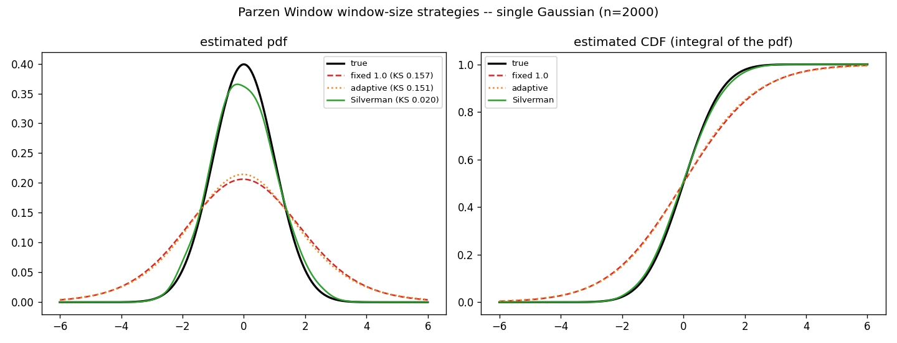
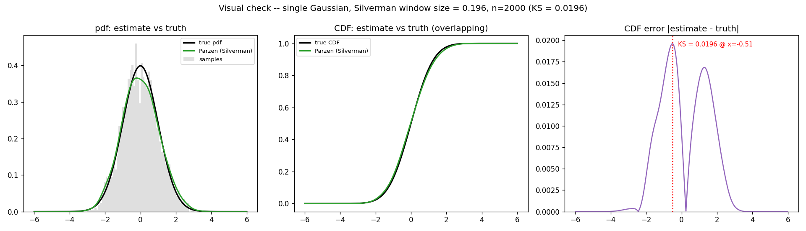
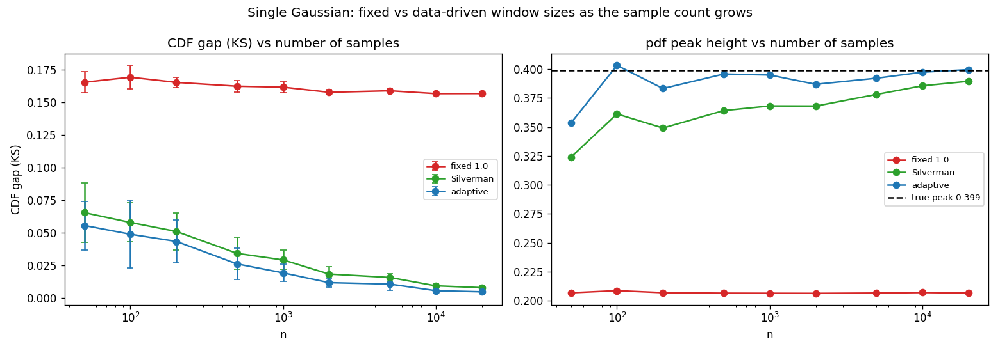
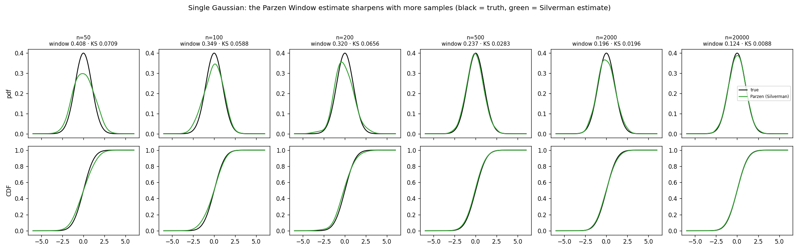

**What each step taught us.**

1. **Fixed window size = 1.0 over-smooths.** The estimated pdf is far too wide and low (peak 0.21 vs
   0.40); the logistic window of "size 1" is itself wide, so the estimate behaves like a much broader
   Gaussian. CDF gap 0.157.
2. **Adaptivity around a too-large pilot does not rescue it.** The per-point windows came out at mean
   1.005 (range 0.93–1.91): they barely shrank in the dense bulk and only widened in the tails, so the
   core over-smoothing remained (gap 0.151). Lesson: an adaptive window size needs a *sensible global
   window* to adapt around.
3. **A data-driven global window size (Silverman) solves it.** Window size 0.196 brings the gap to
   0.0196 — the estimated pdf and CDF sit on top of the truth. The only residual imperfection is the
   pdf peak, estimated a touch low (0.368 vs 0.399).
4. **Sample-size sweep, three methods (fixed 1.0 / Silverman / adaptive with a Silverman pilot;
   5 seeds).** Two clear lessons:
   - **A fixed window does not benefit from more samples** — it never shrinks, so its CDF gap stays
     flat at ~0.16 and its pdf peak is stuck near 0.21 at every `n`. Only data-driven windows improve.
   - **Adaptive (pilot Silverman) is the best at every `n`** and reaches the true pdf peak fastest:

     | n | fixed 1.0 | Silverman | adaptive |
     |---|---|---|---|
     | 50 | 0.165 | 0.066 | 0.056 |
     | 500 | 0.162 | 0.034 | 0.026 |
     | 2000 | 0.158 | 0.019 | **0.012** |
     | 20000 | 0.157 | 0.008 | **0.005** |

   Note the pilot: the adaptive in step 2 used a too-large pilot (1.0) and failed; with a Silverman
   pilot it instead beats Silverman. So adaptivity is good *given a sensible pilot*.

**State of the art (single Gaussian):** Parzen Window with an **adaptive window size (Silverman
pilot)** is best at every budget (Silverman alone is already excellent on this unimodal case; adaptive
adds a further ~35% on the CDF gap). Quality improves smoothly with the sample count; a fixed window
does not. This unifies with the mixtures, where adaptive is also the winner. Next: Phase A, step 2.

---

## Phase A · two Gaussian mixtures

We carry **two operating points** forward from here on (owner's request): **best overall** = abundant
data, `n = 20000`; **best under-2k** = a scarce-data budget, `n = 1000` (`n = 500` reported too). We
compare the consolidated **Silverman** window size against an **adaptive** (per-point) window with a
Silverman pilot, since Silverman tends to over-smooth the valley between modes. Script:
`scripts/parzen_mixtures.py`.

**CDF gap (KS) vs truth** (mean over 3 seeds; lower is better):

| distribution | strategy | n=500 | **n=1000 (under-2k)** | n=2000 | **n=20000 (overall)** |
|---|---|---|---|---|---|
| symmetric `0.5 N(±2,0.7)` | Silverman | 0.079 | 0.065 | 0.048 | 0.024 |
| | **adaptive** | 0.076 | **0.060** | 0.041 | **0.0155** |
| asymmetric `0.65 N(0,1)+0.35 N(3,0.6)` | Silverman | 0.048 | 0.043 | 0.027 | 0.014 |
| | **adaptive** | 0.042 | **0.039** | 0.024 | **0.0098** |

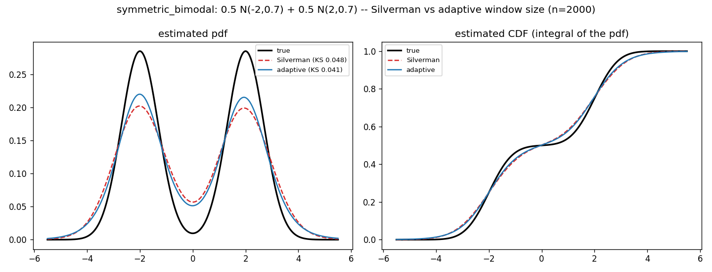
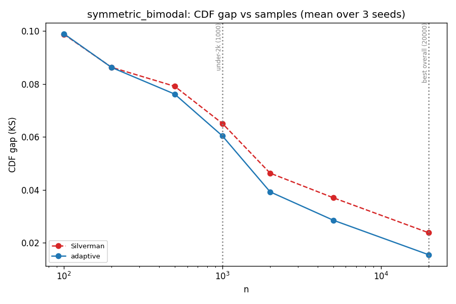
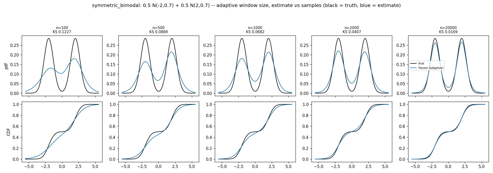
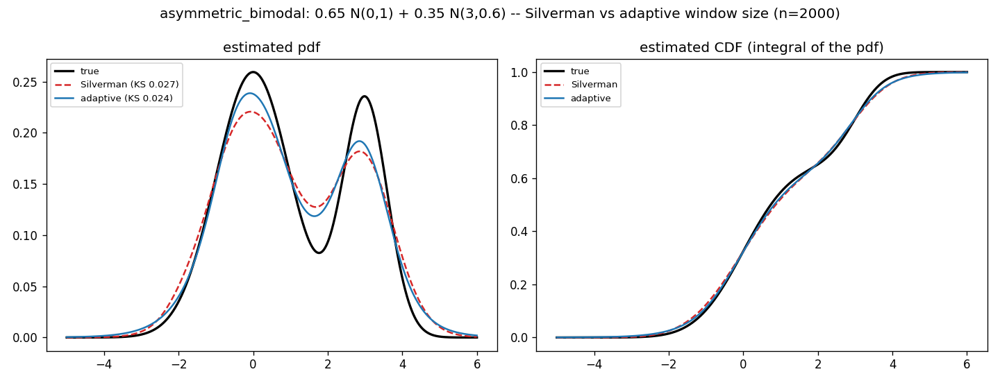
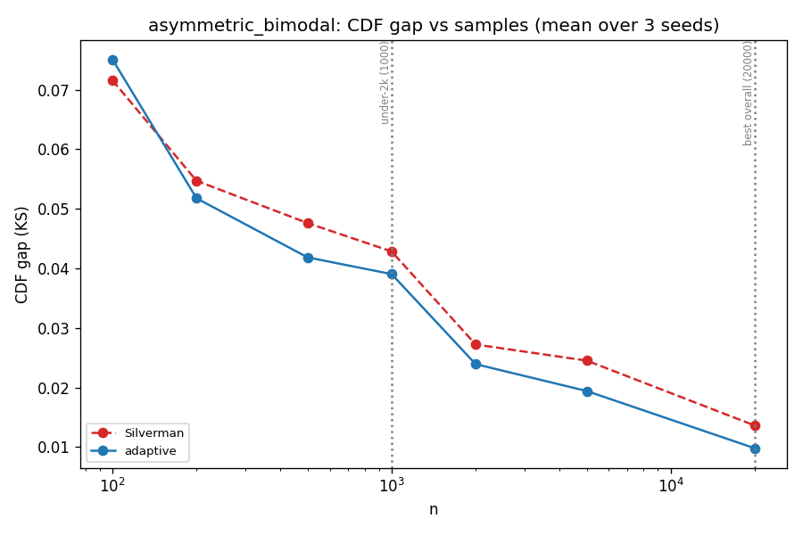
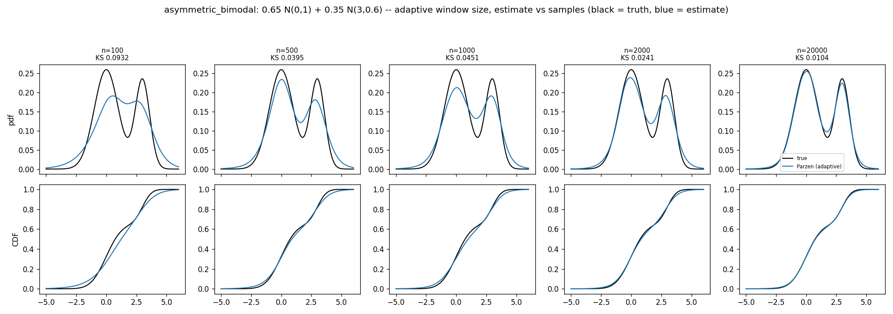

**Findings.**

1. **Adaptive (pilot Silverman) beats plain Silverman everywhere**, modestly at low `n` and more at
   high `n` (symmetric at 20k: 0.024 → 0.0155; asymmetric: 0.014 → 0.0098). So the best strategy for
   mixtures is the adaptive window size.
2. **The two budgets.** *Best overall* (`n=20000`): CDF gap ≈ **0.010–0.016** — good. *Under-2k*
   (`n=1000`): ≈ **0.04–0.06** — moderate. The **symmetric** mixture (well-separated modes, deep
   valley) is the harder one at low `n`; the asymmetric (overlapping modes) is easier.
3. **What needs samples is the multimodal structure.** At low `n` the pdf valley between modes is
   filled in (over-smoothed) and the modes are blunt; the valley deepens and the modes sharpen toward
   the truth as `n` grows (progression figures). The CDF itself stays usable even at `n=500`.
4. **An untapped lever (noted, not yet used).** The adaptive pilot here is the full Silverman window;
   a *sharper* pilot (variance-matched) or a cross-validation window would sharpen further at fixed
   `n`. Held in reserve in case the under-2k accuracy needs to improve.

**State of the art (mixtures, provisional):** adaptive window size (Silverman pilot). **Revised by
step 3 below** once tested on a broader battery. Next: ~10 more complex distributions.

---

## Phase A · step 3: a battery of 10 random complex mixtures

We generate 10 random Gaussian mixtures (3 to 6 modes, varied means and widths via
`data.random_mixture`) and test every truth-free window-size selector on all of them, at the two
budgets. Cross-validation is `O(n^2 * candidates)`, so it is run only at the under-2k budget
(impractical at `n=20000`). One sample set per (mixture, budget), seeded by mixture index. Script:
`scripts/parzen_random.py`.

**Mean CDF gap across the 10 mixtures** (lower is better):

| selector | under-2k (n=1000) | overall (n=20000) |
|---|---|---|
| Silverman | 0.069 | 0.032 |
| variance-matched | 0.044 | **0.015** |
| adaptive (pilot Silverman) | 0.061 | 0.021 |
| likelihood-CV | 0.029 | impractical (`O(n²·cand)`) |
| **LSCV** | **0.028** | impractical |

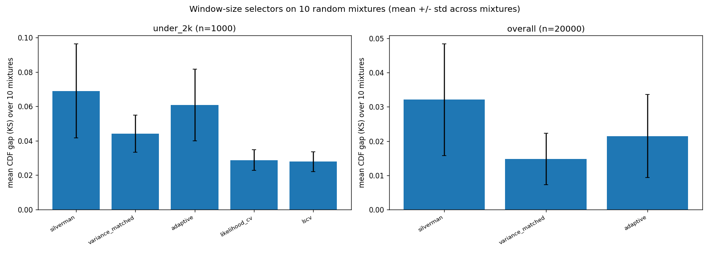
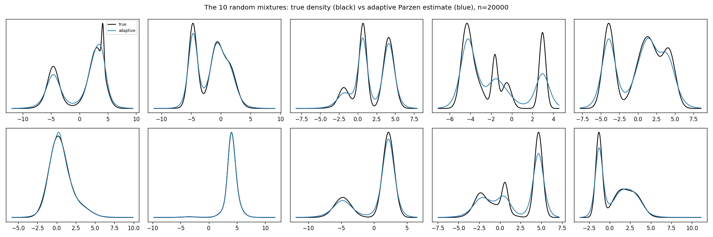

**Findings (the battery overturns the bimodal conclusion).**

1. **Cross-validation (LSCV ≈ likelihood-CV) is the most accurate truth-free selector** (~0.028 at
   under-2k, about 2.4× better than Silverman and clearly better than adaptive). It searches for the
   window that fits the data, which pays off on complex multimodal shapes.
2. **Adaptive does NOT generalize as the winner.** It won on the two hand-picked bimodals, but across
   10 complex mixtures it is only middling (0.061 under-2k, 0.021 overall), worse than variance-matched
   at *both* budgets. Lesson: a conclusion from 2 distributions did not survive 10.
3. **Variance-matched (a cheap `×0.55` shrink of Silverman) is the best practical selector at high
   `n`** (0.015 overall) and second at low `n`. Being `O(n)`, it scales to any `n`, unlike CV.
4. **Silverman is consistently the weakest** (over-smooths), except on near-unimodal/broad mixtures.
5. The gallery shows the adaptive estimate still blunting sharp peaks; CV / variance-matched sharpen
   them better.

**State of the art (truth-free Parzen window), revised:**
- **low-data (under-2k): cross-validation (LSCV)**;
- **high-data (overall): variance-matched** (use CV if its cost is affordable).
Adaptive is demoted to a special-case method (good on simple, well-separated bimodals). This is the
estimator we carry into Phase B (the MLP).

---

# Phase B — the MLP

The network learns the consolidated Parzen CDF, trained **only on the data points** `(xᵢ, F̂(xᵢ))`,
with the pdf recovered as its derivative. We carry the two budgets directly (no 2000 step): under-2k
`n=1000` and overall `n=20000`. On the single Gaussian the Parzen target is the Silverman CDF.

## Phase B · step 1: the simplest possible MLP (single Gaussian)

Setup: one hidden layer (width 16), sigmoidal activations (to mimic the logistic-window CDF shape),
**plain SGD with a fixed learning rate (1.0)**, full batch, 5000 epochs. Adam and other refinements
are deferred to later steps. Script: `scripts/mlp_gaussian.py`.

| budget | Parzen target KS (ceiling) | simplest MLP KS | gap |
|---|---|---|---|
| under-2k (n=1000) | 0.032 | 0.041 | small |
| overall (n=20000) | **0.009** | **0.028** | **large** |

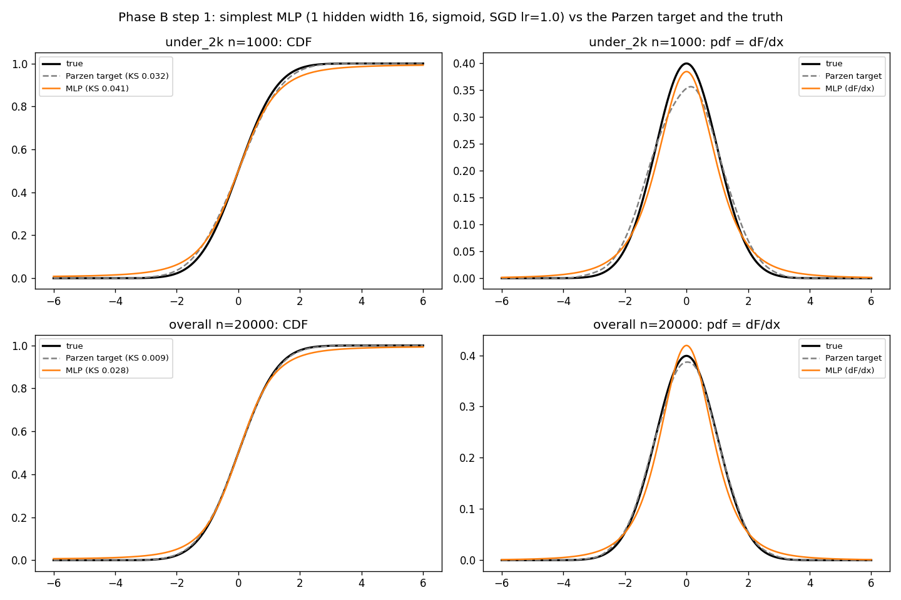

**Findings.**

1. **The simplest MLP undershoots its Parzen target.** It learns a sensible CDF but lags both the
   target and the truth (figure). At under-2k the gap is small (0.041 vs 0.032); at overall it is
   large (0.028 vs a near-perfect target of 0.009).
2. **At high `n` the network, not the target, is the bottleneck.** With abundant data the Silverman
   Parzen target is essentially exact (0.009), but plain SGD at a fixed learning rate cannot match it
   (0.028). This is the clear motivation for the next step (Adam, and more training/capacity).
3. **Monotonicity is not binding** (0% violations) and mass is ~0.98. So, as in Phase A, the
   constraint does not bite yet on this smooth target.

**Next (Phase B, step 2):** swap SGD for **Adam** (the obvious nuance), expecting the network to
reach its Parzen target, then continue with capacity / training refinements.

## Phase B · step 2: Adam closes the gap (single Gaussian)

Same network (1 hidden, width 16, sigmoid, fixed lr, full batch, 5000 epochs); only the optimizer
changes, SGD to **Adam (fixed lr 0.03)**. Script: `scripts/mlp_gaussian.py`.

| budget | Parzen target (ceiling) | SGD (step 1) | **Adam (step 2)** |
|---|---|---|---|
| under-2k (n=1000) | 0.032 | 0.041 | **0.032** |
| overall (n=20000) | 0.009 | 0.028 | **0.008** |

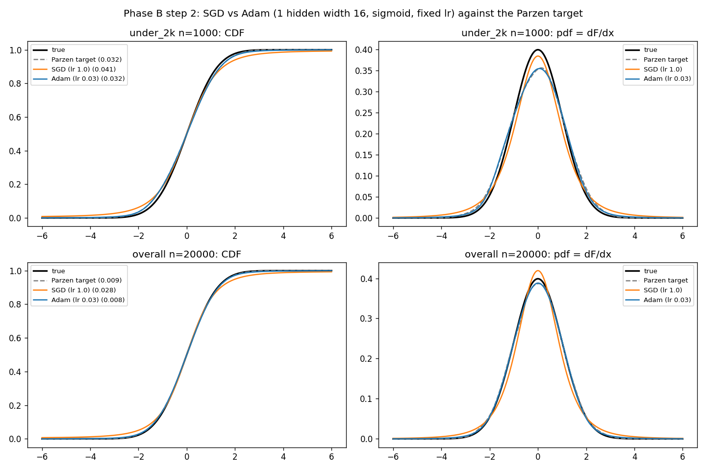

**Findings.**

1. **Adam reaches the Parzen target at both budgets** (n=1000: 0.032 = target; n=20000: 0.008,
   matching/just under the 0.009 target). It fits the labels essentially exactly (train MSE ~1e-6),
   so the network is no longer the bottleneck; the SGD gap of step 1 was purely an optimizer issue.
2. **The recovered pdf improves too**: pdf MSE drops from 2.3e-4 (SGD) to 1e-5 (Adam) at overall, and
   the recovered mass rises from ~0.986 to ~0.999.
3. **Monotonicity still not binding** (0% violations).

So on the single Gaussian, the simplest-but-Adam MLP is a faithful learner of the Parzen CDF at both
budgets.

## Phase B · side study: can the net learn the CDF directly from real data?

Prompted by the question "do we even need the Parzen step?", we train the same network (1 hidden,
width 16, sigmoid, Adam lr 0.03) directly on the **empirical CDF** of the samples, `F_n(xᵢ) =
(rank − 0.5)/n` (the rawest, parameter-free estimate of the true CDF from real data), and compare it
to training on the Parzen target. Single Gaussian, both budgets, **mean ± std over 5 seeds**. Script:
`scripts/mlp_empirical_cdf.py`.

| CDF gap (KS) vs truth | n=1000 | n=20000 |
|---|---|---|
| target: Parzen CDF (Silverman) | 0.029 ± 0.007 | 0.008 ± 0.002 |
| target: empirical CDF | 0.029 ± 0.008 | 0.006 ± 0.002 |
| net trained on Parzen | 0.030 ± 0.006 | 0.008 ± 0.002 |
| **net trained on empirical CDF** | **0.020 ± 0.007** | **0.0054 ± 0.001** |

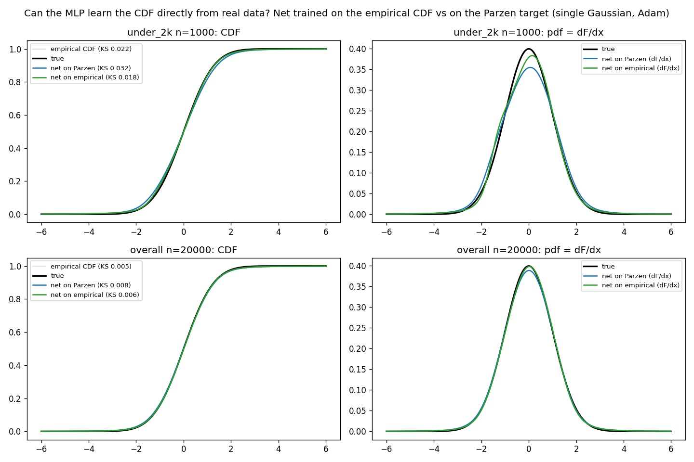

**Findings.**

1. **As targets, the Parzen and empirical CDFs are about equally good** (n=1000: 0.029 vs 0.029;
   n=20000: empirical a touch better, 0.006 vs 0.008). The empirical CDF is unbiased but noisy; the
   Parzen CDF is smooth but carries Silverman's over-smoothing bias.
2. **The network trained on the empirical CDF is the clear winner** at both budgets (~32% lower KS
   than the net trained on Parzen; margin exceeds the seed std), and it even **beats the raw empirical
   CDF** it learns from (0.020 vs 0.029 at n=1000). Its smoothness denoises the unbiased empirical
   target, getting the best of both worlds; the net-on-Parzen instead just reproduces its target and
   inherits the smoothing bias (0.030 ≈ 0.029). The recovered density also recovers the peak better
   (figure), with mass ~0.998.
3. **Implication (provisional):** for the *neural* CDF the Parzen step looks unnecessary, even mildly
   harmful: training directly on the empirical CDF is simpler and more accurate here.

**Caveats / next.** This is the single Gaussian only, and the comparison uses the Silverman Parzen
(which over-smooths); a fairer comparison would use the consolidated CV / variance-matched Parzen, and
the real test is the **mixtures / complex distributions**, where the empirical CDF has no built-in
smoothness and the net's recovered *pdf* (its derivative) may turn wiggly. We confirm there before
concluding the Parzen step can be dropped.

## Phase B · step 3: the MLP on the two bimodals (with a capacity probe)

Back to the main pipeline (Parzen target). Same simplest+Adam network on the two bimodals; the target
is the consolidated Parzen window per budget (LSCV at under-2k, variance-matched at overall, from
Phase A step 3). We probe the hidden width (16, 32, 64). Script: `scripts/mlp_mixtures.py`.

CDF gap (KS) vs truth (target KS in parentheses is the ceiling):

| distribution / budget | target | width 16 | width 32 | width 64 |
|---|---|---|---|---|
| symmetric, n=1000 (LSCV) | 0.036 | **0.036** | 0.037 | 0.037 |
| symmetric, n=20000 (var-matched) | 0.011 | 0.012 *(viol 6%)* | **0.012** | 0.034 *(under-trained)* |
| asymmetric, n=1000 (LSCV) | 0.037 | 0.038 | **0.038** | 0.040 |
| asymmetric, n=20000 (var-matched) | 0.008 | 0.012 | 0.010 | **0.008** |

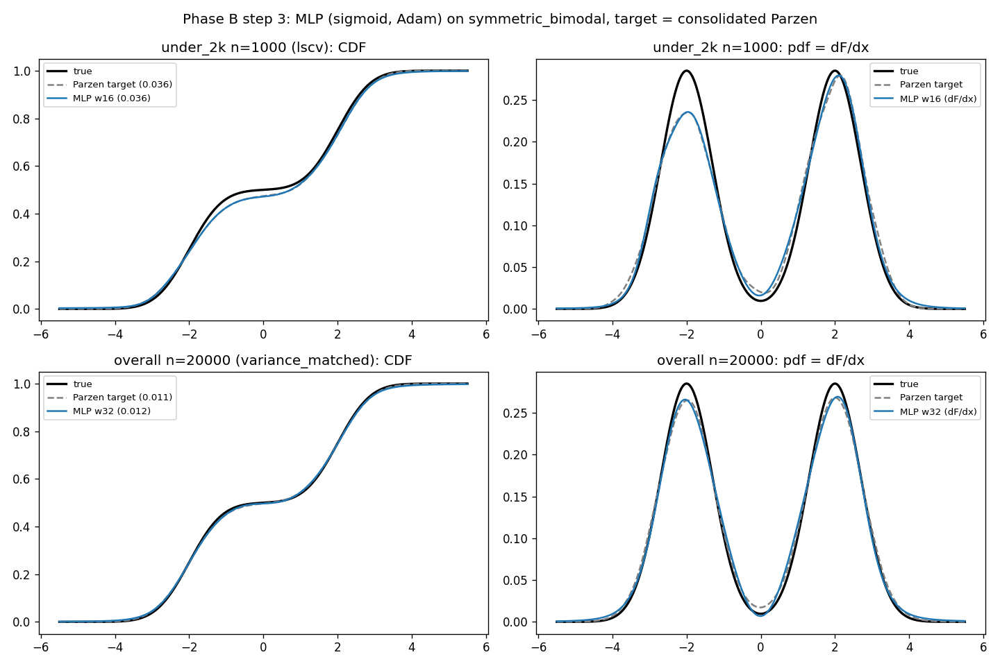
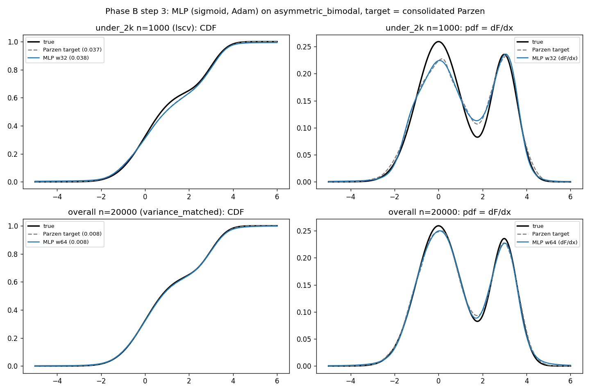

**Findings.**

1. **The MLP reaches its Parzen target on the bimodals too** (net KS ≈ target KS at the best width).
   The "faithful learner" result from the single Gaussian generalises to multimodal CDFs.
2. **Capacity matters mildly and non-monotonically.** Width 16 already suffices at the small budget;
   at the large budget more width helps the asymmetric (width 64 matches the target exactly), but
   **width 64 can *fail* at a fixed training budget** (symmetric: 0.034, train MSE 9e-5, under-trained,
   the same effect as the depth-3 / width-128 blow-ups in Phase A). Bigger nets need more training.
3. **Monotonicity finally bites.** The symmetric mixture at n=20000, width 16, produced **6%
   monotonicity violations** (the first non-zero in the whole study); they vanish at width 32. So the
   constraint becomes relevant in the multimodal / high-n / small-width corner, where the soft penalty,
   Sill construction, or downstream rectification (all available) would matter.

**Next (Phase B):** the random complex distributions (step 4), and addressing monotonicity where it
appears, then the pdf-via-derivative consolidation (checkpoint 1).

## Phase B · monotonicity: which enforcement?

On the regime that violated (symmetric bimodal, n=20000, width 16, variance-matched target; 3 seeds)
we compare the three enforcement routes. Script: `scripts/mlp_monotonicity.py`.

| strategy | KS | viol% | pdf MSE | mass |
|---|---|---|---|---|
| baseline (unconstrained) | 0.0107 | 1.98% | 0.00007 | 0.992 |
| soft penalty λ=10 | 0.0118 | 1.98% | 0.00008 | 0.990 |
| soft penalty λ=100 | 0.0185 | 1.98% | 0.00015 | 0.979 |
| Sill (by construction) | 0.0188 | **0%** | 0.00018 | 0.974 |
| **downstream rectification** | **0.0117** | **0%** | **0.00007** | **1.0000** |

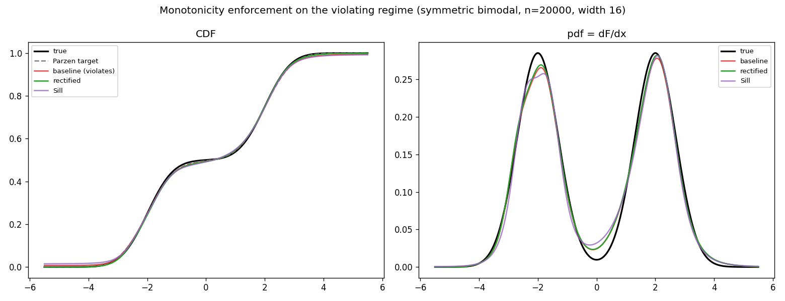

**Findings.**

1. **The soft penalty fails to enforce monotonicity** here: the violation fraction stays at 1.98% even
   at λ=100, and the larger weight only *hurts* the fit (KS 0.011 → 0.019). Penalising at a discrete
   set of points does not guarantee global monotonicity, and it fights the data term.
2. **Sill (monotone by construction) does enforce it (0%)** but at an accuracy cost (KS 0.011 → 0.019,
   worse pdf) because the non-negative-weight constraint limits a width-16 network.
3. **Downstream rectification wins clearly.** Taking the trained net's CDF, applying a cumulative max,
   and rescaling to [0,1] removes all violations at *negligible* accuracy cost (KS 0.012 ≈ baseline
   0.011, identical pdf MSE) and, as a bonus, normalises the recovered mass to exactly 1. The
   violations were small dips that the cumulative max removes without disturbing the good fit.

**Decision:** adopt **downstream rectification (cumulative-max + rescale)** as the monotonicity
strategy. It guarantees a valid CDF and unit-mass density at near-zero cost, and it doubles as the fix
for the small pdf mass loss seen earlier. (Sill stays available as the by-construction alternative.)
`training.rectify_cdf` implements it.

## Phase B · step 4: the MLP on 10 random complex mixtures

The network (one hidden layer, width 32, sigmoid, Adam lr 0.03) on the 10 random mixtures from Phase A
step 3, data points only, consolidated Parzen target per budget (LSCV at under-2k, variance-matched at
overall), with downstream rectification. One sample set per (mixture, budget). Script:
`scripts/mlp_random.py`.

| budget | mean Parzen target | mean net (rectified) | mean raw violations |
|---|---|---|---|
| under-2k (n=1000) | 0.028 | 0.032 | 1.6% |
| overall (n=20000) | 0.015 | 0.020 | 3.3% |

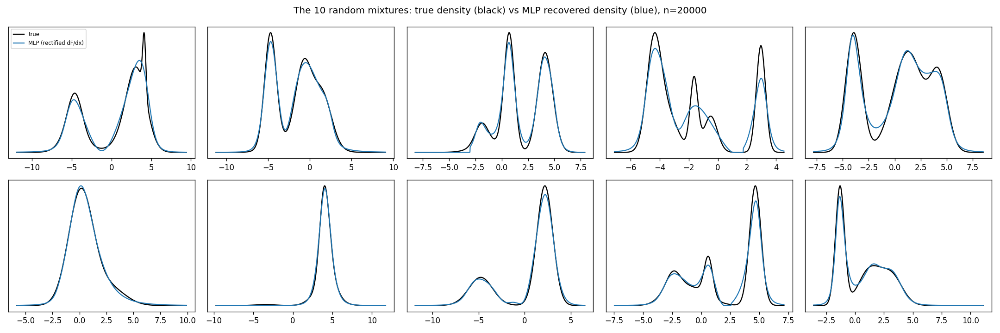
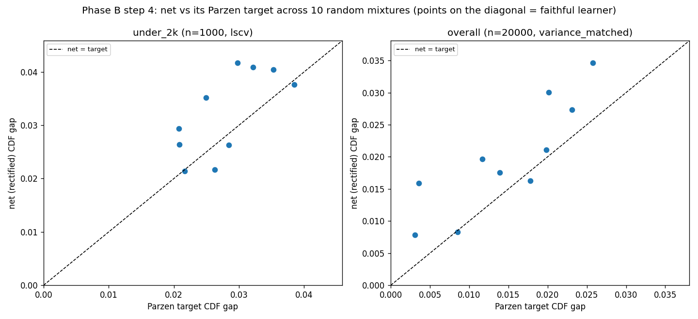

**Findings.**

1. **End to end, the pipeline works on varied complex shapes.** The recovered densities (gallery)
   track the true densities well across the 10 mixtures, capturing multiple modes and broad+sharp
   combinations, blunting only the sharpest peaks.
2. **But the net is no longer a perfectly faithful learner here.** The net-vs-target scatter sits
   *above* the diagonal: the network lags its Parzen target, more so at the overall budget where the
   target is sharpest (mean 0.020 vs 0.015). On the very sharp targets (e.g. mixtures 5, 6 at n=20000:
   target ~0.003 but net ~0.008-0.016) the width-32 network at a fixed training budget cannot fully
   match the target. Capacity / training would have to scale for full fidelity, which is the cost the
   single Gaussian and bimodals did not reveal.
3. **Monotonicity bites notably on complex shapes** (raw violations up to 26% on one mixture, mean
   1.6-3.3%), and **downstream rectification does real work here** (it is no longer a near-no-op as on
   the simple cases): the reported gaps are all from monotone, unit-mass curves.

**Next:** checkpoint 1, the end-to-end consolidation (samples to Parzen CDF to MLP to rectified pdf),
optionally giving the sharpest complex targets a little more capacity/training.

---

# Checkpoint 1 — the consolidated univariate pipeline

The full univariate pipeline in one run (`scripts/checkpoint1.py`):

> samples → consolidated Parzen window (LSCV if n ≤ 2000, else variance-matched) → labels
> `(xᵢ, F̂(xᵢ))` at the data points only → MLP (one hidden layer, width 32, sigmoid, Adam lr 0.03,
> full batch, no validation split) → CDF = network, pdf = its derivative → downstream rectification
> (cumulative-max + rescale: a monotone CDF and a unit-mass density).

Demonstrated on a ladder at both budgets; the overall-budget models are saved to
`results/checkpoint1.pt` (gitignored, regenerable).

| distribution | target (1k / 20k) | pipeline net (1k / 20k) | viol | mass |
|---|---|---|---|---|
| single Gaussian | 0.027 / 0.006 | 0.024 / 0.016 | 0% | 1.000 |
| symmetric bimodal | 0.036 / 0.011 | 0.037 / 0.012 | 0% | 1.000 |
| asymmetric bimodal | 0.037 / 0.008 | 0.037 / 0.009 | 0% | 1.000 |
| **asymmetric trimodal** | 0.027 / 0.015 | **0.081 / 0.088** | 0% | 1.000 |

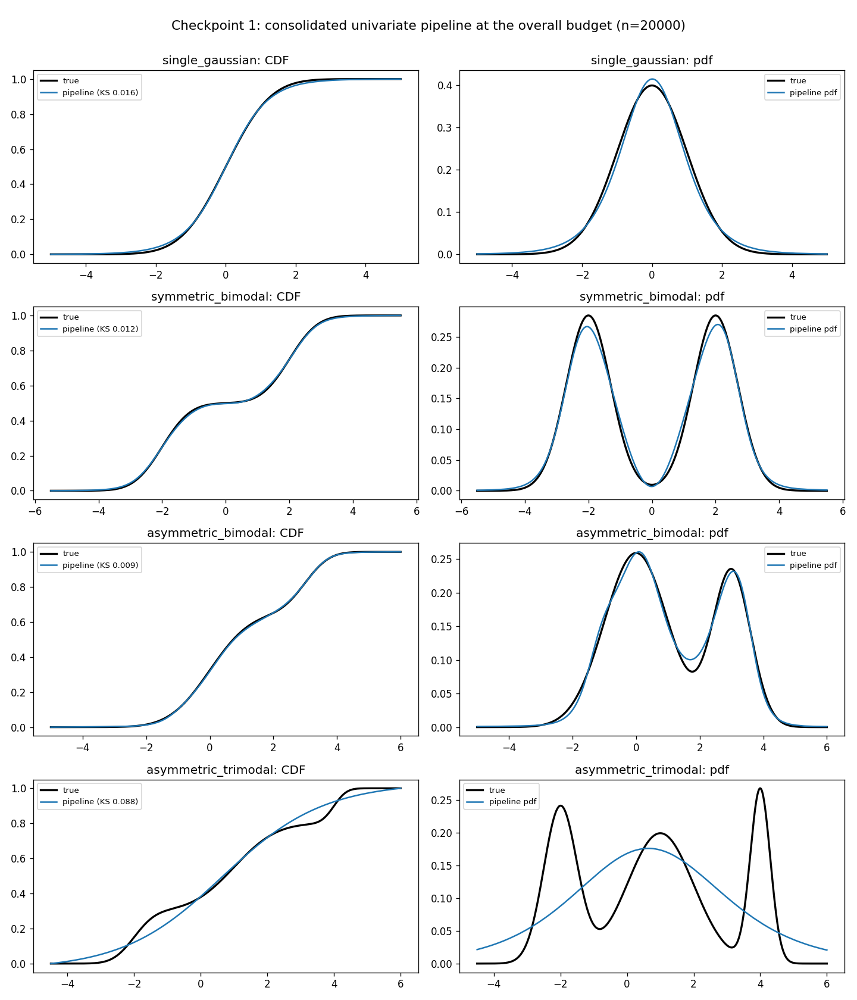

**What checkpoint 1 establishes.**

1. **Monotonicity and mass are fully solved** by the downstream rectification: 0% violations and mass
   exactly 1 on every distribution and budget.
2. **The pipeline is faithful up to bimodal complexity**: the network matches its Parzen target on the
   single Gaussian and both bimodals.
3. **A clear capacity limit on the hardest case.** The asymmetric trimodal (a sharp, well-separated,
   low-weight mode of width 0.3) is blunted: net 0.08 vs target 0.027. The width-32 network at a fixed
   training budget cannot represent it. Scaling capacity / training for sharp targets is the open
   direction, exactly the "progressively more accurate MLP" the plan anticipated.

**Status:** the univariate machinery (Parzen target → smooth, monotone, unit-mass neural CDF → pdf by
differentiation) is validated and consolidated, with its limit identified. This is checkpoint 1.

## Phase B · capacity push: the trimodal limit was not fundamental

Scaling the network on the failing case (asymmetric trimodal), with downstream rectification. Script:
`scripts/mlp_capacity.py`.

| trimodal | Parzen target | w32 e5000 (checkpoint) | w64 e15000 | w128 e15000 | **w32×2 e15000** |
|---|---|---|---|---|---|
| under-2k (n=1000) | 0.027 | 0.081 | 0.028 | 0.028 | 0.029 |
| overall (n=20000) | 0.015 | 0.088 | 0.019 | 0.020 | **0.016** |

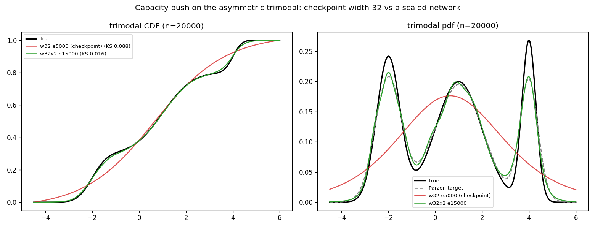

**Finding.** The checkpoint's trimodal failure was **under-capacity / under-training, not
fundamental**. Scaling to **width 64 (or a depth-2 32×32) with 15000 epochs** brings the net from
KS 0.08 down to ~0.016-0.019, **reaching its Parzen target** on the trimodal too (pdf MSE down ~20×;
the figure shows the scaled net recovering all three modes, sitting on the Parzen target, while the
width-32 checkpoint collapsed to a single bump). So the "faithful learner" result holds on *every*
distribution given adequate capacity/training; the remaining gap to the truth is the Parzen target's
own (bandwidth) limit, consistent with the whole study. The simplest network just needs to grow with
the target's sharpness.

---

# Step 1 closed (univariate)

The univariate study is closed pending a discussion with the Professor about Step 2 (multivariate).
State at closure:

- **Parzen estimation (Phase A):** consolidated (Silverman on the Gaussian; adaptive on simple
  bimodals; cross-validation / variance-matched on complex mixtures). Report Parts I to III.
- **The MLP (Phase B):** a faithful regressor of its Parzen target given Adam and adequate
  capacity/training; monotonicity and unit mass guaranteed cheaply by downstream rectification;
  checkpoint 1 consolidated and the sharp-trimodal limit resolved by scaling. Report Parts IV to V.
- **"Does MLP-on-Parzen have an advantage?" investigation** (`temp_analysis/`, 4 manual tests + an
  11-angle verified workflow): **no accuracy advantage in 1D** (the net cannot beat its Parzen target;
  a direct-likelihood model beats both). Genuine, structural advantages: free-validity via the CDF
  route, amortization/compression, and the Sklar/copula economy; plus real-but-non-unique capabilities.
  The honest framing is teacher-student / serving, not estimation. Open multivariate issue: the
  N-increasing monotonicity (the 3D mixed-partial density has a large mass error without it).
  Verdict: `temp_analysis/99_verdict.md`; Italian LaTeX report: `report/analisi_vantaggio.tex`.

Next only if we proceed: fix the design of Step 2 with the Professor (joint CDF + mixed partials, or
copula via Sklar), then enforce N-increasing monotonicity before the multivariate density.
