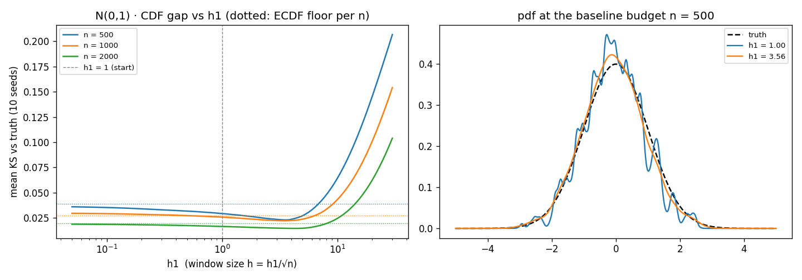
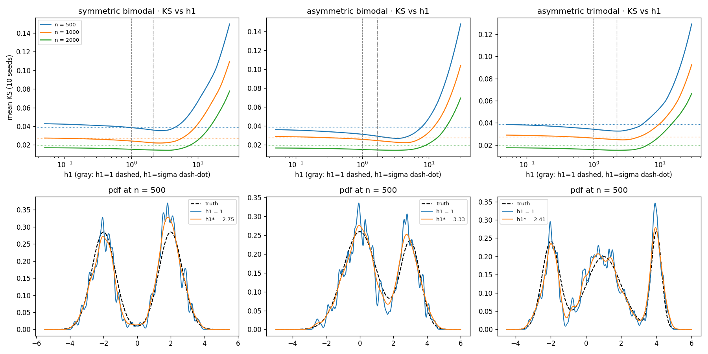
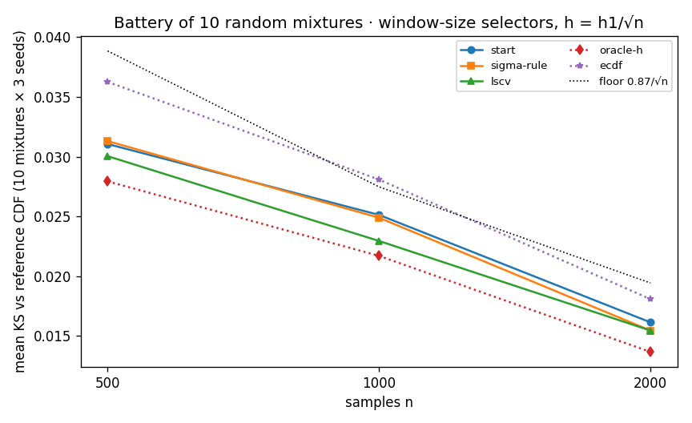
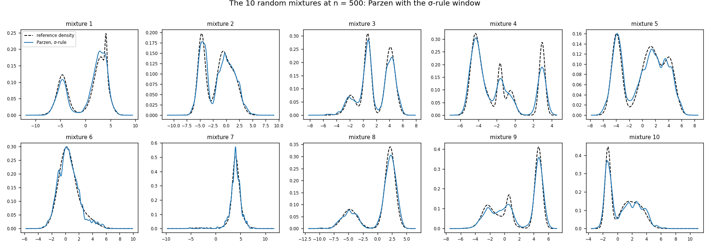
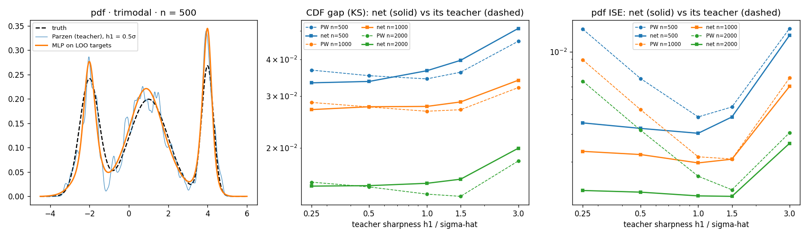
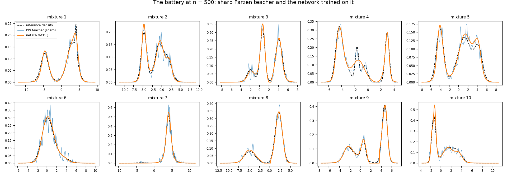
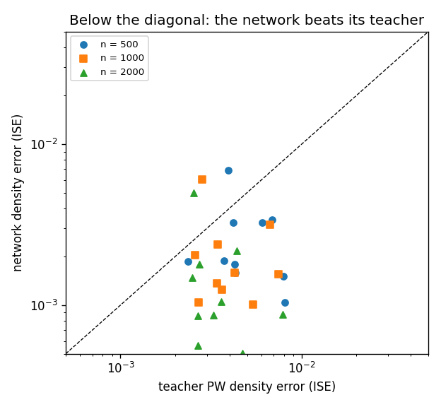

# Didactic study, corrected: the h1/sqrt(n) framework

A full redo of Phase A and Phase B after the review of 2026-07-03 exposed a window-size
scale error in the first pass (see `docs/study.md`, kept as the historical record, and
`temp_analysis/verify_formulation.py` for the verification that the estimator formulation
and the sampling were always correct). This document is the working log; the polished,
self-contained write-up is `report/report2.tex`.

**Framework.** Logistic-window Parzen estimator; the window size follows the deterministic
schedule **h_n = h₁/√n** (`parzen.sqrt_n_bandwidth`), which satisfies the classical
consistency conditions and leaves one number to choose, h₁. Budgets are small on purpose:
**n = 500 (baseline), 1000, 2000**. Primary metric: the CDF gap (KS) against the reference
curve, on a means±5σ grid (2001 points); secondary: the pdf integrated squared error (ISE).
Every table carries the **empirical CDF** and the **statistical floor** E[KS] ≈ 0.8687/√n as
fixed references. On the reference curves: the mixture pdf is closed-form; the mixture CDF
is computed via erf to ~1e-16 relative error, thirteen orders of magnitude below the
measured gaps, so the references are exact for every practical purpose. Sampling is exact
ancestral sampling (categorical component choice + ziggurat normal draws; no CDF inversion
anywhere).

---

## Phase A · calibrating h₁

### Step 1: single Gaussian (`scripts/parzen2_gaussian.py`)

**(a) The untuned start h₁ = 1.0** (mean over 10 seeds):

| n | h = 1/√n | KS | empirical CDF | floor |
|---|---|---|---|---|
| 500 | 0.045 | **0.0293** | 0.0371 | 0.0388 |
| 1000 | 0.032 | **0.0257** | 0.0301 | 0.0275 |
| 2000 | 0.022 | **0.0165** | 0.0191 | 0.0194 |

Already at the floor, already better than the empirical CDF, at every budget.

**(b) The h₁ stress test** (100 values of h₁ ∈ [0.05, 30], mean over 10 seeds):

| n | h₁* (KS) | KS* | 10% plateau | h₁*/σ̂ | h₁* (pdf ISE) |
|---|---|---|---|---|---|
| 500 | 3.56 | 0.0229 | [2.3, 4.3] | 3.6 | 4.1 |
| 1000 | 3.56 | 0.0221 | [1.6, 5.2] | 3.6 | 4.9 |
| 2000 | 4.32 | 0.0145 | [1.4, 6.0] | 4.3 | 5.2 |

Findings: (1) broad, scale-linked optimum at ~3.5σ̂; (2) the optimum drifts as n^(1/6)
(measured 1.21 vs predicted 1.26), which is exactly the mismatch between the schedule's
n^(-1/2) and the CDF-optimal n^(-1/3) rate (Azzalini); (3) **one estimator, two scores, two
optima**: the density estimate and the CDF estimate share the same h (the CDF is the
integral of the estimated pdf), but the ISE of the pdf is minimized at a slightly larger h₁
than the KS of the CDF, because integration averages pointwise wiggle away while the pdf
score sees it directly.

### Step 2: the multimodal ladder (`scripts/parzen2_mixtures.py`)

Same stress on the symmetric bimodal, asymmetric bimodal, asymmetric trimodal (100 h₁
values, 10 seeds):

| distribution | n | h₁* | KS* | KS @ h₁=1 | empirical | floor | 10% plateau | h₁*/σ̂ |
|---|---|---|---|---|---|---|---|---|
| symmetric bimodal | 500 | 2.8 | 0.0353 | 0.0386 | 0.0435 | 0.0388 | [0.9, 4.3] | 1.3 |
| | 1000 | 2.8 | 0.0220 | 0.0242 | 0.0276 | 0.0275 | [1.0, 4.6] | 1.3 |
| | 2000 | 3.6 | 0.0142 | 0.0153 | 0.0170 | 0.0194 | [0.7, 5.2] | 1.7 |
| asymmetric bimodal | 500 | 3.3 | 0.0268 | 0.0313 | 0.0368 | 0.0388 | [1.6, 4.9] | 2.0 |
| | 1000 | 4.3 | 0.0224 | 0.0259 | 0.0292 | 0.0275 | [1.6, 6.4] | 2.6 |
| | 2000 | 3.1 | 0.0143 | 0.0152 | 0.0168 | 0.0194 | [0.6, 6.0] | 1.9 |
| asymmetric trimodal | 500 | 2.4 | 0.0326 | 0.0343 | 0.0392 | 0.0388 | [0.5, 4.3] | 1.1 |
| | 1000 | 2.8 | 0.0247 | 0.0263 | 0.0293 | 0.0275 | [0.6, 4.6] | 1.2 |
| | 2000 | 2.4 | 0.0153 | 0.0160 | 0.0178 | 0.0194 | [0.3, 4.6] | 1.1 |

Findings: multimodality pulls the optimum down (to 1.1–2.6·σ̂: the window must resolve the
narrowest feature, not the global spread), the plateaus are wide, and the loss is asymmetric
(flat left of the optimum, steep right), so a rule of thumb must err small. Frozen before
the battery:

> **σ-rule: h₁ = 1.5·σ̂**, i.e. h_n = 1.5·σ̂/√n
> (truth-free, O(n), scale-invariant; σ-scaled smoothing has precedent in Specht's PNNs)

### Step 3: battery of 10 random mixtures (`scripts/parzen2_random.py`)

Ten random mixtures (3–6 components, `rng(0)` construction), 3 seeds per (mixture, budget).
LSCV runs on a σ̂-based candidate grid (40 values, 0.01–0.5·σ̂). The oracle picks, per
sample set, the fixed window minimizing the measured KS against the reference curve (an
upper bound; it uses the reference, which no data-driven selector can).

| selector | n=500 | n=1000 | n=2000 |
|---|---|---|---|
| start (h₁ = 1.0) | 0.0311 | 0.0251 | 0.0161 |
| **σ-rule (h₁ = 1.5·σ̂)** | 0.0313 | 0.0249 | **0.0154** |
| LSCV (O(n²)) | **0.0300** | **0.0229** | 0.0154 |
| oracle fixed-h | 0.0279 | 0.0217 | 0.0137 |
| empirical CDF | 0.0363 | 0.0281 | 0.0181 |
| floor 0.87/√n | 0.0388 | 0.0275 | 0.0194 |

Worst-mixture means: start/σ-rule/LSCV all ≈ 0.041/0.038/0.022; robust across shapes.

**Phase A verdict:** the σ-rule sits at the floor from n = 500 on every shape tested,
matches LSCV at zero cost, and leaves 10–15% to a reference-using oracle.

---

## Phase B · the PNN recipe on the CDF

The Parzen Neural Network construction (Trentin 2018): leave-one-out targets, deliberately
sharp window, deliberately small network; the LOO labels fluctuate with mean zero around
the underlying curve, and a low-capacity smooth fit through them lands closer to the truth
than the labels themselves. Transplanted to the CDF: teacher h_n = 0.5·σ̂/√(n−1), labels
y_i = (n·F̂(x_i) − ½)/(n−1) (the sample's own window contributes σ(0) = ½ to the full
estimate; subtract it and average over the other n−1), width-8 sigmoidal MLP trained on the
sample points only (Adam, 6000 epochs), pdf by differentiation, downstream rectification.

### Step B1: capacity probe + regime sweep (`scripts/mlp2_pnn_cdf.py`)

Capacity (trimodal, n=1000, sharp teacher 0.5σ̂, 5 seeds): width 8 → ISE 0.0021 vs teacher
0.0043 (halved); width 16 ≈ 8; widths 32/64 → 0.013/0.018, **worse than the teacher** (they
fit its noise). Small capacity IS the regularizer. Width 8 frozen.

Sweep (h₁/σ̂ ∈ {0.25, 0.5, 1.0, 1.5, 3.0} × budgets × 5 seeds): net beats its teacher on
pdf ISE by 2–5× at sharp teachers, parity at smooth ones; KS gains marginal (the CDF is
noise-immune by integration); the net's ISE is nearly flat in the teacher's sharpness (the
window-size problem almost disappears on the net side); at n=500 the net beats even the
σ-rule PW on both metrics (KS 0.0337 vs 0.0362, ISE 0.0033 vs 0.0045).

### Step B2: enforcing monotonicity (`scripts/mlp2_monotonicity.py`)

Under the frozen recipe (trimodal, 5 seeds): raw control, downstream rectification, soft
loss penalty λ·mean(relu(−F̂′)) at 256 collocation points for λ = 1/10/100, and Sill
monotone-by-construction networks.

| regime (n=1000) | KS | ISE | viol % (delivered) | mass |
|---|---|---|---|---|
| raw | 0.0266 | 0.00218 | 1.74 | 0.990 |
| rectified | 0.0267 | 0.00220 | 0 | **1.000** |
| penalty λ=1 | 0.0270 | 0.00214 | **0** | 0.990 |
| penalty λ=10 | 0.0285 | 0.00266 | 0 | 0.989 |
| penalty λ=100 | 0.0338 | 0.00511 | 0 | 0.981 |
| Sill | 0.0269 | **0.00212** | **0** | 0.987 |

(similar pattern at n=500 and 2000; full tables in the script output). Findings: a gentle
penalty (λ=1) removes most violations at zero cost; strong penalties fight the data term
(2–3× worse ISE); **Sill is free in this regime** (unlike the first study's regime of wide
nets on clean targets, where it cost accuracy): with width 8 on noisy LOO targets it matches
unconstrained accuracy with zero violations everywhere by construction. Mass exactly 1 comes
only from rectification, which composes with any of them. Practical recipe: rectification
alone, or Sill + rectification.

### Step B3: the battery (`scripts/mlp2_battery.py`)

Frozen recipe on the same 10 mixtures, 3 seeds each:

| estimator | KS 500 | KS 1000 | KS 2000 | ISE 500 | ISE 1000 | ISE 2000 |
|---|---|---|---|---|---|---|
| PW teacher (0.5σ̂) | 0.0303 | 0.0268 | 0.0207 | 0.00518 | 0.00424 | 0.00370 |
| **net (PNN-CDF)** | **0.0299** | 0.0259 | 0.0206 | **0.00265** | 0.00215 | 0.00151 |
| PW σ-rule | 0.0310 | 0.0251 | 0.0194 | 0.00329 | 0.00205 | 0.00143 |
| empirical CDF | 0.0354 | 0.0307 | 0.0227 | | | |
| floor | 0.0389 | 0.0275 | 0.0194 | | | |

Scoreboard vs its own teacher: **pdf ISE better in 27/30** cases (~2× on average), KS better
in 20/30.

**Phase B verdict:** trained only at the sample points on sharp LOO Parzen labels, the
width-8 network generalizes a better density estimate than the Parzen Window it learned
from; the advantage concentrates at small n (at 500 it also beats the best truth-free
Parzen on both metrics; by 2000 the σ-rule PW ties on ISE). Mechanism: variance removal by
limited capacity; hence density-side gains, CDF-side parity.

---

# State of the art (corrected study)

- **Parzen reference:** logistic window, h_n = 1.5·σ̂/√n (σ-rule). At the floor from n=500.
- **Network reference:** LOO targets at h_n = 0.5·σ̂/√(n−1), width 8, sample points only,
  rectification (optionally Sill + rectification for construction-level monotonicity).
  ~2× the teacher's density accuracy at 500–2000 samples.
- Open: per-case width selection by cross-validated likelihood; multivariate (N-increasing).
- Deliverable: `report/report2.tex` (self-contained, objective; no references to the
  superseded first pass).
